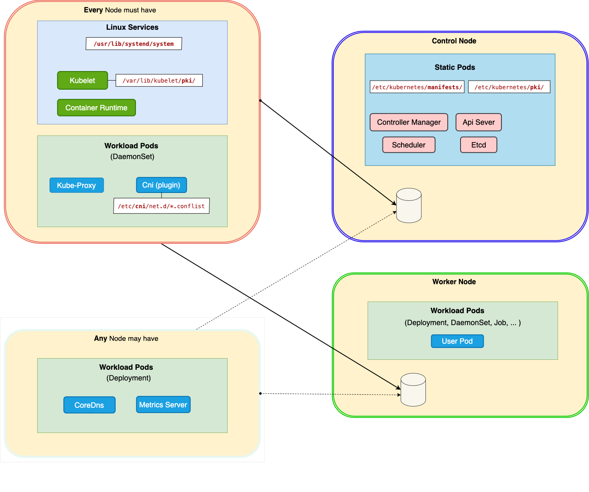

# Cluster Overview
A cluster is a single independent Kubernetes _installation_, with the following main components. 
(Typically all control nodes are identical, and all worker nodes are identical)

Note: [Workload Pods](./components/pods/workload/workload_pods.md) means pods  allocated by the [Scheduler](components/pods/static/system/scheduler.md) ie pods with are _not_ [Static Pods](components/pods/static/static_pods.md)




###
- Linux Services eg (**service**)
    `find` **`/usr/lib/systemd/system`** `| grep kube`

    - i). [Kubelet](components/linux_service/kubelet.md) 
    - i). [Container Runtime](components/linux_service/container_runtime.md) 
####
-  All System Pods (ie all non-user pods) are in the _kube-system namespace_:  
    `k get` **`pods`** **`-n kube-system`**‚ in turn organised into 3 subgrous

    ####
    - 1). `k -n kube-system get` **`ds`**
        - [Kube-Proxy](components/pods/workload/system/kube.proxy.md)

    ####
    - 2).`k -n kube-system get` **`deploy`**
        - [CoreDNS](components/pods/workload/system/core_dns.md)
        - [Network Plugins (Cni)](components/pods/workload/system/cni.md)
        - [Metrics Server](components/pods/workload/system/metrics_server.md) (if installed)

    ####
    - 3). `ls` `/etc/kubernetes/`**`manifests/`**  (static pods)
        - [Controller Manager](components/pods/static/system/controller-manager.md)
        - [Api Server](components/pods/static/system/apiserver.md)
        - [Scheduler](components/pods/static/system/scheduler.md)
        - [Etcd](components/pods/static/system/etcd.md)


    ####
    (details below)


---- 

#### <i class="fa-brands fa-linux"></i> Service Files (linux)
[systemd](../../../../../../os/linux/startup/init_process.md) service (esp config) files  are located in **`/usr/lib/systemd`**
- `find` **`/usr/lib/systemd`** **`| grep kube`**
    ```yaml
    /usr/lib/systemd/system/kubelet.service
    /usr/lib/systemd/system/kubelet.service.d
    /usr/lib/systemd/system/kubelet.service.d/10-kubeadm.conf
    ```

#### System Pods 
- `k` **`-n kube-system`** `get` **`pod`** `-o wide`
```yaml
NAME                                      READY   STATUS       NODE  .....         

# cni (`canal` is a hybrid cni that includes `calico` and `flannnel`)
calico-kube-controllers-94fb6bc47-rxh7x   1/1     Running      controlplane   
canal-phldr                               2/2     Running      node01         
canal-zl4tq                               2/2     Running      controlplane   

# core dns
coredns-57888bfdc7-685jj                  1/1     Running      node01         
coredns-57888bfdc7-bbwzr                  1/1     Running      node01     

# static pods
kube-controller-manager-controlplane      1/1     Running      controlplane     
kube-apiserver-controlplane               1/1     Running      controlplane     
kube-scheduler-controlplane               1/1     Running      controlplane     
etcd-controlplane                         1/1     Running      controlplane     

# kube proxy
kube-proxy-2mfwz                          1/1     Running      controlplane   
kube-proxy-z2ps8                          1/1     Running      node01         
```

#### (System) Static Pods (Manifests)
- `ls -1`    **`/etc/kubernetes/manifests/`**
    technically you could additioanlly put a _user_ (ie non-system) mainfest in here too
    ```yaml
    etcd.yaml
    kube-apiserver.yaml
    kube-controller-manager.yaml
    kube-scheduler.yaml
    ```

#### System  Workload Pods
- k **`-n kube-system`** `get` **`deploy`**
```yaml
NAME                      READY   UP-TO-DATE   AVAILABLE   
# cni
calico-kube-controllers   1/1     1            1          
# coredns
coredns                   2/2     2            2           
```

#### System  Daemon Set Pods (KubeProxy)
- `k` `-n kube-system` `get` **`ds`**
    ```yaml
    NAME         DESIRED   CURRENT   READY   UP-TO-DATE   AVAILABLE   NODE SELECTOR            AGE
    canal        2         2         2       2            2           kubernetes.io/os=linux   6d23h
    kube-proxy   2         2         2       2            2           kubernetes.io/os=linux   6d23h
    ```

--- 
- **which nodes** are running which pods
    - `k get pods -A -o wide` **`--sort-by=.spec.nodeName`**
- only pods on specific nodes
    - kubectl get pods --all-namespaces --field-selector spec.nodeName=controlplane
#### Namespaces

- Allow sharing of single cluster by [dividing](../kubeconfig/namespace.md) it into multiple (logically separated) virtual clusters.

#### Cluster Federation
- Note: While there are ways to join multiple clusters, this functionality is not part of Kubernetes itself, but added on top (eg Openshift Federation)


