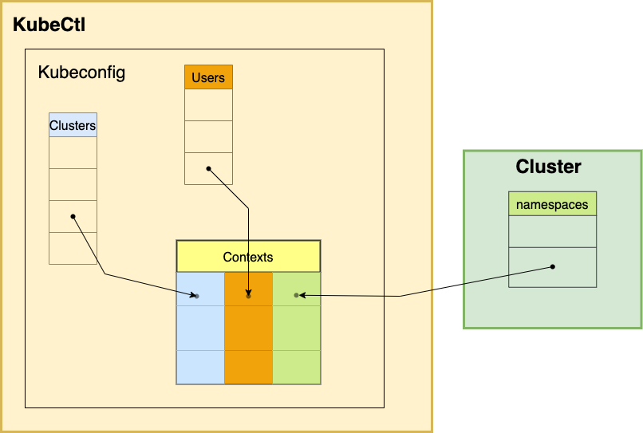

##### KubeConfig (KubeCtl Config) 
is a list of _definitions_ (all details) of

- #### Clusters 
- #### Users 

as well as list of (valid) _combinations_ of _{cluster, user, namespace}_ called **[Contexts](context.md)**


###
- editable through 
    - `k` **`config`** `[--kubeconfig <file_path>]` `<command>`
        - where `command`:  {`set-context`, `set`, `view`,...} 

####
- dynamically calculated **from**     
    - in order (only first found used) contents of :

        - `<file_path>`(if passed)
        - `KUBECONFIG` env var - list of file paths, with contents **merged** 
        (entry in *file later* in list, taking *precedence* if entry in multiple files)
        - **`~/.kube/config`** file 

    ###
    - `k config` **`view`**
        #####
        ```yaml
        apiVersion: v1
        clusters:
        -   cluster:
                name: kubernetes

                # API Server IP address
                server: https://172.30.1.2:6443 
                
                ## base64-encoded certificate authority (CA) certificate used by client to verify the API server's certificate    
                certificate-authority-data: <base64-encoded-CA-cert>  
            
        contexts:
        -   context:
                cluster: kubernetes
                user: kubernetes-admin
                namespace: my-ns   ##  `namespace: default` implicit if not explicitly set 
            name: kubernetes-admin@kubernetes
        current-context: kubernetes-admin@kubernetes
        kind: Config
        preferences: {}
        users:
        -   name: kubernetes-admin
            user:
                # Base64-encoded client certificate and private key.
                client-certificate-data: <base64-encoded-cert>
                client-key-data: <base64-encoded-private-key>
        ```

##
- _Note_:
    - Despite the name, this is a configuration  for **Kubectl**, _not_ _Kubernetes_ (server) itself 
