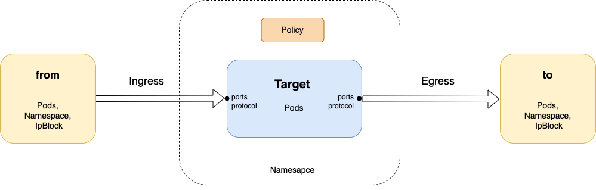

### Network Policy 
Restricts communication to/from target pods in a single **namespace** (that policy exists in), based on their **labels**. More, precisely it restricts the **`direction`** of `connection establishment` (once established the traffic can flow freely in either direction) - [online editor](https://editor.networkpolicy.io/)




 
 

- #### General Structure
    ```yaml
    spec:

    # Target Pods 
        #   (have to exist in -same namespace- as policy itself)
        #   (pods, namesapce, ip block) access to/from target pods (on ports, with protocol) will be restricted  in "from" and "to" sections below
        podSelector:        
                # Label only (matching) 

    # Blanket Exclusion (if listed here)
        policyTypes:    
        - Ingress               
        - Egress                

        # Exceptions to above (blanket) exclusion 
        # egress: {}              # all
        ingress:                  # specific (details below)
                                
    # from/to (pods, namesapce, ip block)   
        #   (do not have to exist in same namespace as policy itself)

        # Rules 
            # Each `to:` and `from:` constitutes a single rule
            # Satisfying any (whole) rule is sufficient in order for a conection to get permitted
            # But all conditions in a rule must be satisfied in order to satify the rule as a whole.

    
        
        # Rule 1
        - from/to:          
            - podSelector:          # sub conditions of from/to condition
            - namespaceSelector:
            - ipBlock:

          ports:

        # Rule 2
        - from/to:          
          ports:


    ```

##### Example


- *policy.yaml*
    ```yaml
    apiVersion: networking.k8s.io/v1
    kind: NetworkPolicy
    metadata:
        name: my-policy
        namespace: my-ns
    spec:
    # Target Pods - those affected by below
    #-----------
    #   podSelector: {}          # targets all pods in __same namespace__ (as policy)
        podSelector:
            matchLabels:            # targets all pods with __labels__ "my-key1=my-val1" and "my-key2=my-val2"
                my-key1: my-val1
                my-key2: my-val2

        # Rules
        #--------
        policyTypes:              # blanket forbids (need explicit exceptions in ingress/egress below).
        - Ingress               
        - Egress                

        # egress: {}              # would explicitly allow everything
        ingress:                  # explicit exceptions allowing incoming traffic (__to__ pods matched by __above__ podSelector)
                                    # __from__ pods that 1) match on these labels

        # Rule 1
        - from:
            - podSelector:          # pod in the local Namespace with matching labels 
                matchLabels:
                    my-key6: my-val6
            # ports conditions always (AND) further filter the from/to part of the rule 

        # Rule 2 
        - from:
            # each "- from/to, ports" is a **--Rule--** and they combine as "OR"
        
            #  Rule 2, Condition 1
            - podSelector:          # pod in the local Namespace with matching labels 
                matchLabels:
                    my-key3: my-val3
                    my-key4: my-val4
            
            #  Rule 2, Condition 2
            # Conditions (AND together): each condition (is a list item) in rule which combine as "AND" 
            - namespaceSelector:    # _OR_ from any Pod in any namespace with matching labels
                matchLabels:
                    my-key5: my-val5       

            # ports conditions always (AND) further filter the from/to part of the rule 
          ports:                # _AND_ are 2) incoming to these ports (default - all ports)
          - protocol: TCP
            port: 3306
    ```


- `k create ns my-ns`
- `k apply -f policy.yaml`
#####
- `k describe netpol my-policy -n my-ns`

    ```yaml
    Name:         my-policy
    Namespace:    my-ns
    Created on:   2024-08-25 08:51:16 +0000 UTC
    Labels:       <none>
    Annotations:  <none>
    Spec:
    PodSelector:     my-key1=my-val1,my-key2=my-val2
    Allowing ingress traffic:
        To Port: <any> (traffic allowed to all ports)
        From:
        PodSelector: my-key6=my-val6
        ----------
        To Port: 3306/TCP
        From:
        PodSelector: my-key3=my-val3,my-key4=my-val4
        From:
        NamespaceSelector: my-key5=my-val5
    Allowing egress traffic:
        <none> (Selected pods are isolated for egress connectivity)
    Policy Types: Ingress, Egress
    ```


 - `Allows` incoming connection requests to target pod, (independently) from both, all pods matching rule (**Any Rule** must be satisfied in order for policy to be satisfied) 
    -  Rule 1:
         - pod labels: my-key6: my-val6  

    - Rule 2 (**All Conditions _in rule_** must be satisfied, in order to satisfy rule)
        - pod labels: my-key3: my-val3, my-key4: my-val4
        - in namespace with labels: my-key5: my-val5  
        - on port 3306

    port `3306`, _only_,  from pods matching (from) labels or (from) namespace
 - `Denies` all outgoing connection requests from target pod  (to anywhere) 
