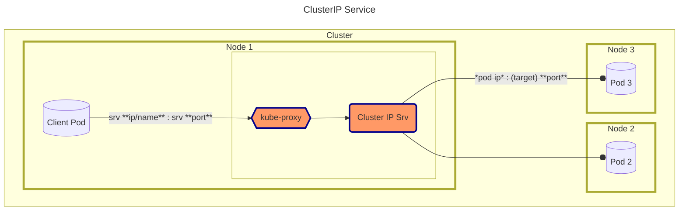

## Cluster IP (Service)
- Stable IP (as long as service exists) for targeting pods, from **_inside cluster only_**
- Pods targeted are those whose **labels** match the service **selector**
- When multiple pods targeted, one picked (round-robin on the node by default) for each new incoming connection
- Forwards 
    - `service_ip`  &nbsp;&nbsp; &nbsp;&nbsp;  :**`port`** --> 
    - `target_pod_ip`  :**`targetPort`**
        targetPort is **not unique** (cluster-wide, unlike nodePort) ie
        ***different* services**, (label-based) targeting ***different* pods** can use ***same* targetPort**

`kube-proxy` on each node configures iptables (or IPVS) rules. These rules are local to that node. They intercept traffic destined for the ClusterIP services, and change the destination IP address of the packet from the ClusterIP to the IP address of one of the target Pods.   


---


---


#### Service

- `k create` **`service`** **`clusterip`** `my-ser` **`--tcp=8000:80`** `-o yaml --dry-run=client > ser.yaml`

    ####
    or, using (optionl, preferred) [port name ](../pod_with_named_port.md)

    ####
-  `k create service clusterip my-ser --tcp=8000:`**`my-port`** `-o yaml --dry-run=client`

    #####
    - see also [expose](../expose.md)


###
- **ser.yaml** (see also [pod definition](../pod_with_named_port.md))
    ```yaml
    apiVersion: v1
    kind: Service
    metadata:
      name: my-ser
    spec:
        type: ClusterIP         # default

        ports:                  # service can listen on multiple ports - one for each app it "services"

        - port: 8000            # service port - clients target this port on service   
          targetPort: 80        # service targets this port on pod
        # targetPort: my-port        # equivalent (preferred) -if- pod has defined port with name "my-port" and value "80" 

        selector:             # pods with these labels are targeted 
          app: my-app  

- `k apply -f ser.yaml`
- `k get service  [-o wide]`  
    - `-o wide`  SELECTOR also shown 

    ```yaml
    NAME         TYPE        CLUSTER-IP     EXTERNAL-IP   PORT(S)    AGE    SELECTOR
    # api server
    kubernetes   ClusterIP   10.96.0.1      <none>        443/TCP    21d    <none>

    # the new service (reachable at address "10.106.78.83" or name "my-ser" :
    my-ser       ClusterIP   10.106.78.83   <none>        8000/TCP   3m1s   app=my-app  <-- 
    ```


#### Query

####


- Service 
    - `k describe service my-ser`
        ```yaml

        Name:                     my-ser
        Namespace:                default
        Labels:                   <none>
        Annotations:              <none>
        Selector:                 app=my-app
        Type:                     ClusterIP
        IP Family Policy:         SingleStack
        IP Families:              IPv4
        IP:                       10.106.78.83          # service  address
        IPs:                      10.106.78.83  
        Port:                     <unset>  8000/TCP     # service port
        TargetPort:               80/TCP                # pod (target) port
        Endpoints:                
        Session Affinity:         None
        Internal Traffic Policy:  Cluster
        Events:                   <none>

        ```
####
- Pods  (**92.168.1.4**:80)
    - **`k get endpoints`** `[my-ser]` 
        ```yaml
        NAME         ENDPOINTS         AGE
        kubernetes   172.30.1.2:6443   21d   # api server
        my-ser       192.168.1.4:80    17m   #  target pod ip:port 
                                             #     commas sep list, if multiple running pods match service selector)
                                                  
        ```

    - `k describe endpoints` my-ser  
        - more verbose (only additional info - names of target ports)      
    ###                             
    - **`k describe pod`** `my-pod`
        ```yaml

        IP:               192.168.1.4           # --- ip address of pod
        Node:             node01/192.168.1.4     # node (name and address) on which pod is running
        ...
        ```
---
### [CoreDNS](../../dns.md)
 from inside cluster, you can just use **service name**[.ns] instead of ip address 
- from same namespace:
    - `wget --spider` **`10.107.108.124`** `:8000` ->
    - `wget --spider` &nbsp;&nbsp;&nbsp;&nbsp;&nbsp;&nbsp;&nbsp;&nbsp;&nbsp;&nbsp;&nbsp;&nbsp;&nbsp; **`my-ser`** `:8000`
- from different namespace
    - `wget --spider` **`my-ser.default`** `:8000`     (for  service in ns "default")

---


#### Connect
######  From
- 1). Pod **NOT targeted** by service
    #####
    - `k run tst` `--image=busybox` `--restart=Never` **`[--rm]`** **`-it`**   `-- /bin/sh`
        - **`[--rm]`**   delete pod after terminates
        - **`-it`** wont see output without this
    - `wget` **`--spider`** `my-ser:8000` 

    ####
    - or as single command:
     `k run tst --image=busybox --restart=Never` `--rm` `-it`  **`-- /bin/sh` `-c ` `"wget --spider my-ser:8000"`**


        ```yaml
        Connecting to 10.104.86.159:8000 (10.104.86.159:8000)
        remote file exists
        
        pod "tst" deleted  # because of `--rm` 
        ```


##            
- 2). Pod **targeted** by service
    - `k exec` **`my-pod`** **`-- curl`** `my-ser:8000`
        can connect fine from a pod that service targets too
        ```yaml
        <h1> Welcome to nginx! </h1>
        ...
        ```
##
- 3). **localhost** ([proxy](../../from_local/proxy.md))
    - **`k proxy`** `[--port=8001]` `[&]` 
        - default port: 8001
        - `&` move to bdg to free terminal for next command (or just use different terminal)
        ```yaml
        Starting to serve on 127.0.0.1:8001
        ```
    - `curl -L localhost:8001/` `api/v1/` `namespaces/default` `/services/my-ser:8000` `/proxy`
        
        - `-L` follow redirects        
        - `/proxy` api server should `forward` service at the rest of url 

----
-  *Note:*


    ####
    - same pod(s) can  be targeted by **multiple services** (simultaneously)  

   


         
