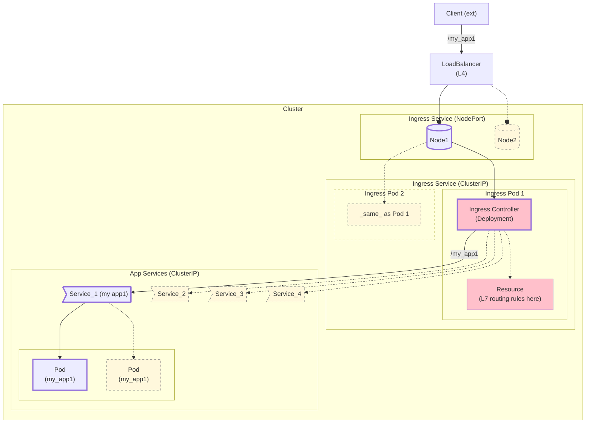

### Ingress

- Extends ClusterIp Service to provide ***L7 routing*** (based on host, path, headers, etc)  to other internal (Cluster IP) _application_ services, typically via **Ingress Controllers** on the pods implementing the ingress service.

- _Externally accessible_ through  a [nodePort](../node_port.md) service (possibly supported by [load balancer](../load_balancer.md))


- Doesnt consume limited node ports (for each application service)


--- 


---

The most important manifests needed are 

####
### Resource 

- Specifies 
    - **routing rules**  and  
    - **ingress class** 
        - which in turn should point to a (unique type of) controller to use


    ####
    ```yaml
    apiVersion: networking.k8s.io/v1
    kind: Ingress     # ie Ingress Resource (is whats described here)
    metadata:
        name: next-app-example1
        namespace: ns               # should be same as the namespace of the target (application) service (in `rules` below)
    annotations:
        nginx.ingress.kubernetes.io/rewrite-target: /$1
        kubernetes.io/ingress.class: "nginx-example1"   # deprecated - use `spec.ingressClassName` instead
    spec:
        ingressClassName: "nginx-example1"   # deployments use this to see if this is the resource whose (routing) rules the^^y need to use
    rules:
        -   host: next.example1.com             #  (optional, target) Host header from the incoming HTTP request can be compared to this 
        # when making routing decisions

        - http:
            paths:
            -   path: /app
                pathType: Exact
                backend:
                    service:
                        name: app-service
                        port:
                            number: 8080
    ```


### Controller
- #### Class (redundant/optional?)
    -  The **IngressClass** points to the type of Ingress Controller    to use. For each (type of) ingress controller (instance), you need     a corresponding **IngressClass** resource with a **unique** name. Its actually (seems) quite redundant - the deployment can/does find the resource directly via `spec.ingressClassName` (not through class). There's no direct mapping from IngressClass to specific resources or deployments - only to _controller types_ (whatever use this is - could also equally well be placed in Resource if needed)


        ```yaml
        apiVersion: networking.k8s.io/v1
        kind: IngressClass                   # ie Ingress Controller    (is whats described here)
        metadata:
            name: nginx-example1             

        spec:
            controller: k8s.io/ingress-nginx    # ... controller    (type)  to use

            #--------
            # parameters:
            #   others possible - controller specific
        ```

- #### Deployment    
    - The pods running with the implementation of the controller
        ```yaml
        apiVersion: apps/v1
        kind: Deployment
        metadata:
          name: nginx-ingress1-ingress-nginx-controller
        ...
        spec:
            ....
            spec:
              containers:
                - name: controller
                  image: registry.k8s.io/ingress-nginx/controller:v1.12
                  args: 
                        - --ingress-class=nginx-example1            #  how deployment knows which resource to watch (looks for resources with matching `spec.ingressClassName`)
                        - --controller-class=k8s.io/ingress-nginx   # should match spec.controller in class
                                 
            .... 
        ```

- There are various types (implementations) of controllers available (eg nginx, traefik, haproxy aks). Each implementation you wish to be able to use must first be made available to the cluster (usually via helm) 

    - #### Install via helm
        ####
        The following commands create everything needed (loadbalancer, deployment,  ingress class...)
         - **except** the ingress _resource_ - you have to create this _manually_ (containing your custom routing rules) and making sure to use same `ingressClassName` as below


        ####
        - add local cache entry **`ingress-nginx`** for https://kubernetes.github.io/ingress-nginx
            - `helm repo add ingress-nginx https://kubernetes.github.io/ingress-nginx`
            
        

        ####
        - show (rendered) manifest files that would be created
            (just replace `template` -> `install` to actually install on the cluster
            ####
            - 
                ```yaml
                helm install nginx-ingress1 ingress-nginx/ingress-nginx \
                --namespace ingress-nginx \     # repo/chart to install
                --create-namespace \            # separate namespace (optional)
                --set controller.replicaCount=2 \
                --set controller.ingressClassResource.enabled=true \  # create Class resource (kind: **IngressClass**) also 
                --set controller.ingressClassResource.name=nginx-example1 \  # set `ingressClassName` of the Class resource  to this value
                --set controller.ingressClass=nginx-example1    # tell deployment which ingress class to watch - should match `ingressClassName` in Class 
                                                                # and thus what rules to follow

                ```


 