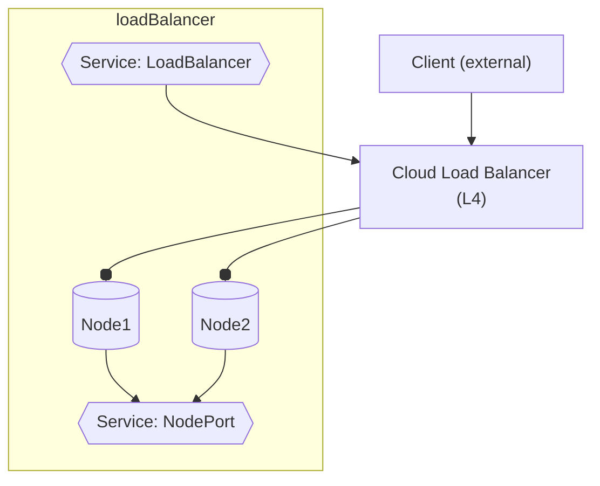

#### Load Balancer


- Creating a _Kubernetes `LoadBalancer`_ Service internally relies on NodePort (it will allocate a NodePort behind the scenes).

####
- It typically requires cloud-provider integration to provision an (external) **cloud load balancer**.
  - This cloud load balancer then forwards traffic to the NodePorts on the cluster nodes.
  - If nodes are added or removed from the cluster, Kubernetes automatically updates the cloud load balancer's target group (a significant advantage over provisioning cloud balancer manually or with IaC)

###
- **Cloud Load Balancer**
    
    - Expensive
    - Forwarding (no L7)
        - L3 (ip)  
        - L4 (port) -  effectively distinguishing protocols
        
        - Not **L7** - cant distinguish paths (need ingress for this)
    ##### 
    - Balances (matching) nodes.

---

###


---
    
#### Query

####
- `k get service my-ser -o wide`  
    
    -   `EXTERNAL-IP` - gets allocated (cf nodePort, clusterIP )
        ```yaml
        NAME     TYPE           CLUSTER-IP      SELECTOR    PORT(S)          EXTERNAL-IP              

        my-ser   LoadBalancer   10.111.21.162   app=my-app  8000:31598/TCP   <pending>
        ```