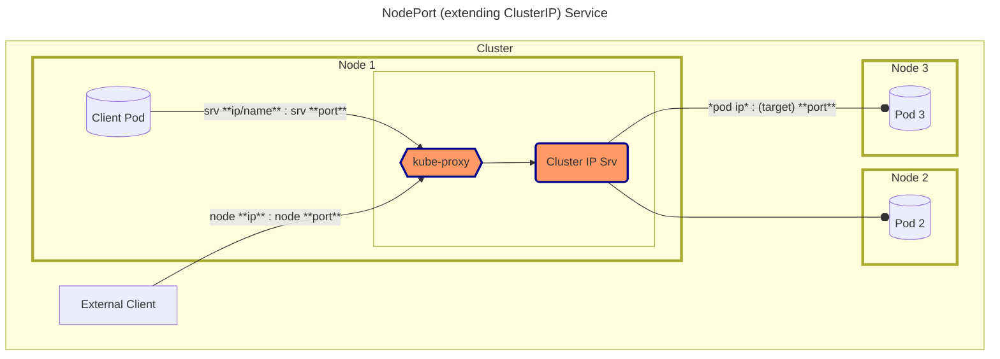
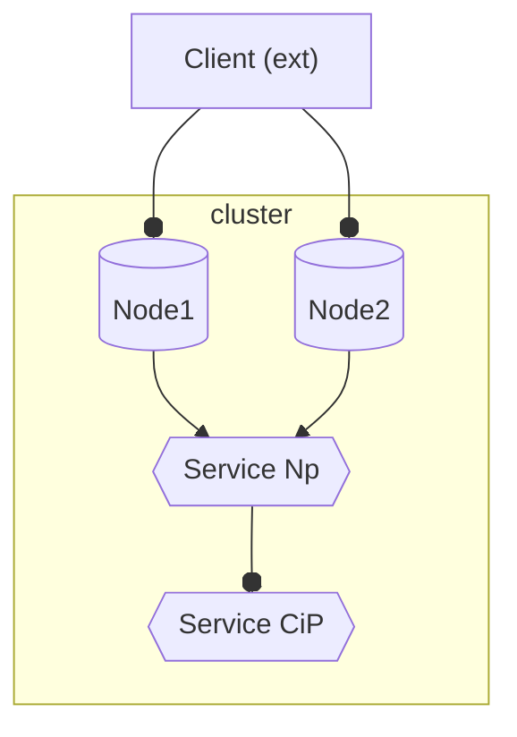

## NodePort (Service)

A node port service in kubernetes is esentially like a web applciation listening on the given node port on every node in the cluster. when a request comes into any node at that port, the node passes it on to the cluster ip service it wraps (essentially passing it to kube-proxy on that node which routes the messsage to the appropriate pod (ip) and target port


#####
- Forwards 
    - `node_ip`  &nbsp;&nbsp; &nbsp;&nbsp;&nbsp;&nbsp;&nbsp;&nbsp;&nbsp;  :**`nodePort`** --> 
    - `target_pod_ip`  :**`targetPort`**

####
- **`node_ip`** is the IP address of *any* **worker** node in the cluster

#####
- **All** *worker nodes* in the cluster are **identically** configured to **participate** in traffic forwarding,  on the specified (node)Port to the associated service. And thus whatever (inside or outside the cluster) that can reach any node, can reach the service
####
- **`nodePort`** is *automatically*  allocated, (if a specific value is not requested, which must be) cluster-wide *unique* 


####
-  **Routing** decisions are based **only** on **port number**
A *single* (worker) *node* can be used by *multiple* NodePort *services*, each with a unique nodePort. The node forwards requests to the ip of ~ service based solely on the port number of the incoming request, URLs (in the request) are not used.


###
---


---

#### Service
same as  [clusterIP](cluster_ip.md), except:

- `clusterip` -> `nodeport` in *k create*
- **ClusterIP**  -> **NodePort** in *manifest*


#### Pod
- same as  [clusterIP](cluster_ip.md)


---
#### Query

- `k describe service my-ser`
    ```yaml

    # different/new 
    Type:                     NodePort
    NodePort:                 <unset>  31482/TCP        # 31482:            nodePort        <--- *) need this    (automatically allocated)
    ```

#### Connect

- **as before** (access from within cluster) :
     - `k run tst --image=busybox --restart=Never` `--rm` `-it`  `-- /bin/sh` **`-c `** `"wget --spider my-ser:8000"`

        ```yaml
        Connecting to 10.104.86.159:8000 (10.104.86.159:8000)
        remote file exists
        
        pod "tst" deleted  # because of `--rm` 
        ```
##
- **New** - access from **outside** cluster  :
     - `curl` **`172.30.2.2`** **`:31570`**
        - with 
            - **node_ip** &nbsp;&nbsp;(`k` **`describe`** `pod` &nbsp;&nbsp;&nbsp;&nbsp;**`my-pod`**)
            - **nodePort**  (`k describe service` **`my-ser`** )
        ```yaml
        <h1> Welcome to nginx! </h1>
        ...
        ```