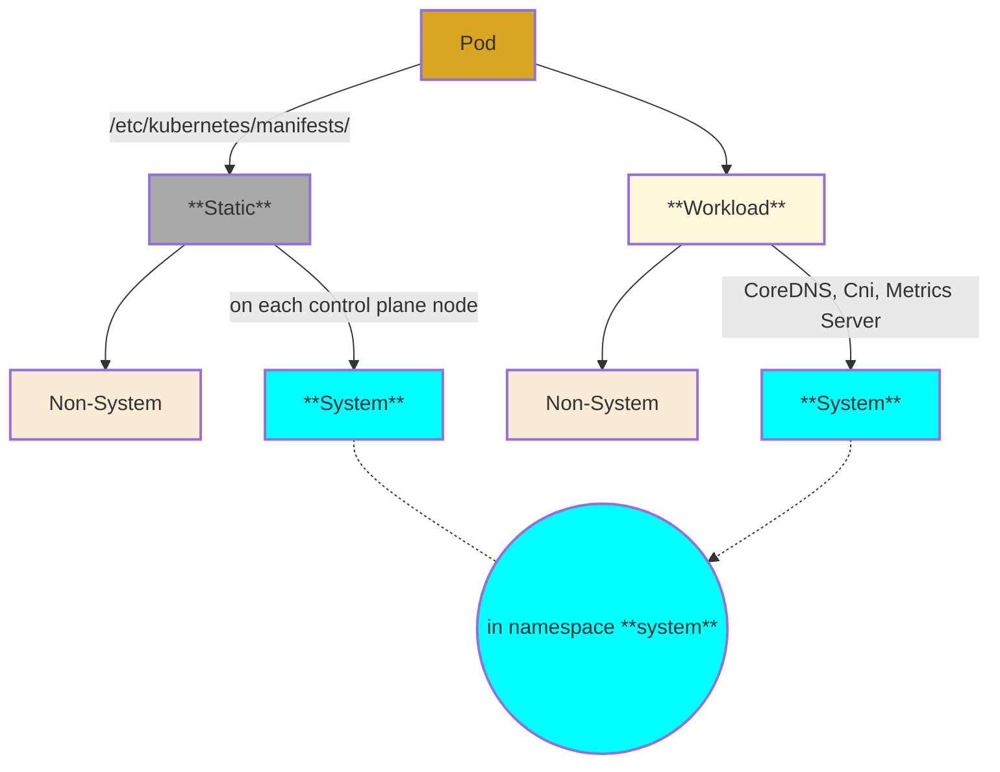

### Pod

- A wrapper around a set of closely connected containers
(see also [auxillary containers](../../resource//pod/auxillary_containers.md)) 
    -  All **containers** (co-located and co-scheduled) 
        - sharing
            - do share **same**:
                - **IP address** (which is unique)
                - [namespaces](../../../../docker/tech/process_isolation.md)
                    - **net** (thus localhost and _port space_) 
                    - **mnt** (thus _filesystem volumes_ eg [pod ephemeral volumes](../../resource/storage/volumes/2_pod-ephemeral.md)) 
                    - ipc
                - uts
            - do **not** share 
                - _pid_ namespace 
                - _cgroups_ 
        - are _collocated_ - on a single node (containers never spread across multiple nodes)
 
    
    - contains some _glue_ that help integrate them into rest of kubernetes 
        - metadata (names, labels, annotations, restart policy)

          
---
####
- All pods are ultimately started by **Kubelet** on node in question, but some (staic) it does so independently and directly reading manifests in a pre-defined location, and the rest (workloads) only when/where told to do so by scheduler (and controller manager) we distinguish

##
- #### [Workload](../../general/architecture/components/pods/workload/workload_pods.md) Pods
    Those managed by **controller manager** and **scheduler**, which in turn tell **kubelet** when/where to start/stop them. This includes system workloads like CoreDNS, metrics server, and network (CNI) plugins.

- #### [Static](../../general/architecture/components/pods/static/static_pods.md) Pods
    -  are those which an individual **kubelet** instance, on a given node,
     starts/stops a pod based on presence of a manifest file in  **`/etc/kubernetes/manifests/`**, on said node
        - Critical system components have, by default, a copy of the respective manifest on every control plane node
            - _Api Server, Controller Manager, Scheduler, Etcd_,
            so that each control plane node runs a copy of these system static pods
        - but you can create any  non-system pod static you create by placing a manifest file into
        _/etc/kubernetes/manifests_

