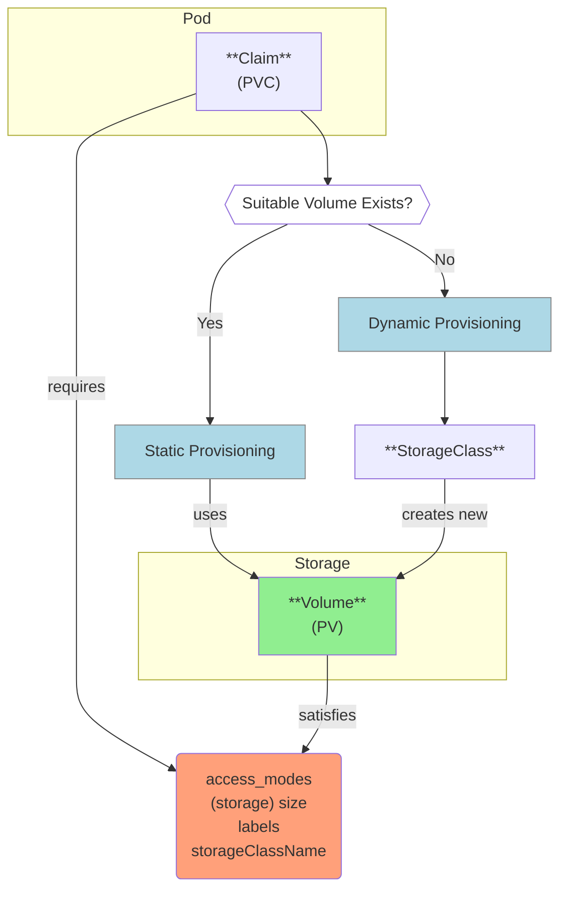

### Persistent Volumes
Outlive pods and nodes (unlike eg hostPath, which is node-dependent and not recommended for production)

#####
- The pod must include a **PersistentVolumeClaim** which essentially describes what kind of volume it requires.
    - multiple pods can share the same PVC if they're in the same namespace.
- If a suitable volume *already* exists Kubernetes uses this - **_Static Provisioning_**.
- If not, and the claim includes a *storageClassName*, and a **StorageClass object** (basically contains details of how to provision a volume automatically) with this name exists, then Kubernetes uses this storage class object to create a suitable new volume - **_Dynamic Provisioning_** 

#### Static Provisioning
- Admin (manually) creates **PersistentVolume** (PV)
- Pod specifies **PersistentVolumeClaim** (PVC)
- Kubernetes _binds_ PVC to existing PV based on:

    #####
    1. *Access modes* (e.g., ReadWriteOnce)
    2. *Storage size*
    3. *Labels/selectors* (preferred matching method)

    ####
    4. *StorageClassName* (optional **string** matching)
        - Just a matching string, NOT referencing a StorageClass object
        - Better to use labels/selectors instead

#### Dynamic Provisioning
- Admin creates **StorageClass object** defining:
    - _name_
    - *Provisioner* (storage backend)
    - *Parameters* (provisioner-specific)
- Pod specifies **PersistentVolumeClaim** (PVC) with *storageClassName*
     (which must match name of an  existing storage class object)
    - StorageClass **automatically** creates **PersistentVolume** (PV) when (name) matching PVC is created
    - no manual PV creation needed

--- 
###
- ##### Volume Access Modes (and sharing among pods):
    - Whether multiple pods can use a volume depends on the intersection of the access modes requested by the pods (via their PVCs) and the access modes supported by the underlying volume (PV). Each can specify:

        - `ReadWriteOnce`: Only pods on same node can use volume
        - `ReadOnlyMany`: Multiple pods on different nodes can read
        - `ReadWriteMany`: Multiple pods on different nodes can read/write
        - `ReadWriteOncePod`: Only one pod total can use volume

- ##### Claim-Volume binding (Status) and Pod/Claim -> Volume deletion

    When a volume (Pv) has been allocated to a claim (Pvc) the `status` of each   becomes **`BOUND`**.
    - this binding is **independent of pods**:  
        - the binding exists regardless of whether pods (are deleted or) still using the claim.  
    and remains in effect until the claim itself is deleted (`k delete pvc`).

    - when the **claim** is **_deleted_**, what happens to the **_volume_** is governed by its **reclaim policy**:
        - `Delete` → volume (pv) + storage are _destroyed_.  
        - `Retain` → volume (pv) becomes `Released` (data preserved for manual reuse).  

