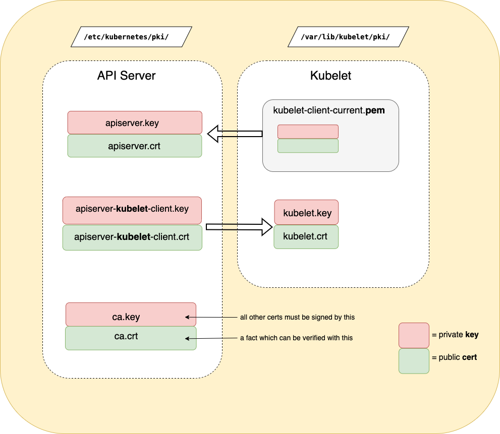

- ### PKI (Certificates and Keys)

### 



`kubelet-client-current.pem` 
 - is a symbolic link to a a file that gets regularly rotated (eg  kubelet-client-_some_timestamp_.pem)

###
(see also [PKI certificates and requirements](https://kubernetes.io/docs/setup/best-practices/certificates/))

###
- #### Query & Manage


    ###
    - 1). [tasks - administer-cluster - generate certificates manually](https://kubernetes.io/docs/tasks/administer-cluster/certificates/#openssl)
   
        can work with an arbitrarty cert file eg:
        #####
        - **`openssl x509`**  **`-noout -text -in`** `/etc/kubernetes/pki/apiserver.crt`
        display information in the specified cert (eg _validity_: to -> from)

            ```yaml
            Certificate:
                Data:
                    Version: 3 (0x2)
                    Serial Number: 1063121937792813603 (0xec0f7c50f10ca23)
                    Signature Algorithm: sha256WithRSAEncryption
                    Issuer: CN = kubernetes
                    Validity
                        Not Before: Jan 28 15:58:51 2025 GMT
                        Not After : Jan 28 16:03:51 2026 GMT
                    Subject: CN = kube-apiserver
                ......
            ```


            see also  [troubleshooting-kubeadm](https://kubernetes.io/docs/setup/production-environment/tools/kubeadm/troubleshooting-kubeadm/#tls-certificate-errors)
    
    ##
    - 2).  [setup tools - kubeadm - kubeadm certs](https://kubernetes.io/docs/reference/setup-tools/kubeadm/kubeadm-certs/) 
        works exclusively with certs in `/etc/kubernetes/pki/` (ie static pods - see above) eg:
        ######
        - `kubeadm certs` **`check-expiration`**
            [view expiration](https://kubernetes.io/docs/reference/setup-tools/kubeadm/kubeadm-certs/#cmd-certs-check-expiration) of all certs

            ```yaml
            [check-expiration] Reading configuration from the cluster...
            [check-expiration] FYI: You can look at this config file with 'kubectl -n kube-system get cm kubeadm-config -o yaml'

            CERTIFICATE                EXPIRES                  RESIDUAL TIME   CERTIFICATE AUTHORITY   EXTERNALLY MANAGED
            admin.conf                 Jan 28, 2026 16:03 UTC   357d            ca                      no      
            apiserver                  Jan 28, 2026 16:03 UTC   357d            ca                      no      
            apiserver-etcd-client      Jan 28, 2026 16:03 UTC   357d            etcd-ca                 no      
            ....... 
            ```
        ######
        - `kubeadm certs` **`renew`** `[all | apiserver....]`
            [renew certs](https://kubernetes.io/docs/reference/setup-tools/kubeadm/kubeadm-certs/#cmd-certs-renew) - reset (remaining) validity to 1 year 
                - not sure if/when this should also happen automatically


    ---
- ### Tokens
    Tokens are a like "invitations" to join that a node presents to the server before then further authenticating/authorizating itself using TLS (certs, keys)  first level verification that the server uses. They are saved in **`etcd`**. see [doc](https://kubernetes.io/docs/setup/production-environment/tools/kubeadm/create-cluster-kubeadm/#join-nodes)

    ####
    - Get an existing **token** from
        - `kubeadm token` **`list`**

    ####
    - If none are available (expire after 24 hrs), you can create a new one with
        - `kubeadm token` ***`create`***

####

 ---

- ### Joining nodes
    - **`kubeadm join`** `172.30.1.2:6443` **`--token`** `rikaqz.qf5s8mgk6jxjm22k`
**`--discovery-token-ca-cert-hash`** `sha256:b7dbee498b70886b8aa2f16ddf50262c78007c2ef1e49d30ff5c7bf0f3a00b17`

        - This command is output as part of [kubeadm init](../../admin/cluster_setup/cluster_setup_single_control.md). Below details and how to regenerate if you no longer have parameters.

        

            - `token`: 
                is used by control plane to ensure node has an "invitation" to join 
            - `discovery-token-ca-cert-hash` : 
                - is a hash of the (root) CA certificate's (usually automatically self signed during `kubeadm init`) public key. 
                - is used by kubeamd on node to verify control planes cert

                <details>
                    <summary>manual generation</summary>

                - **CA Cert** Hash (see [doc](https://kubernetes.io/docs/setup/production-environment/tools/kubeadm/create-cluster-kubeadm/#join-nodes)) 
                    - used in `discovery-token-ca-cert-hash` above can also be manually generated:

                    - `openssl x509 -pubkey -in /etc/kubernetes/pki/ca.crt | openssl rsa -pubin -outform der 2>/dev/null | openssl dgst -sha256 -hex | sed 's/^.* //'`
                        ```yaml
                        b7dbee498b70886b8aa2f16ddf50262c78007c2ef1e49d30ff5c7bf0f3a00b17
                        ```
                </details>

       


