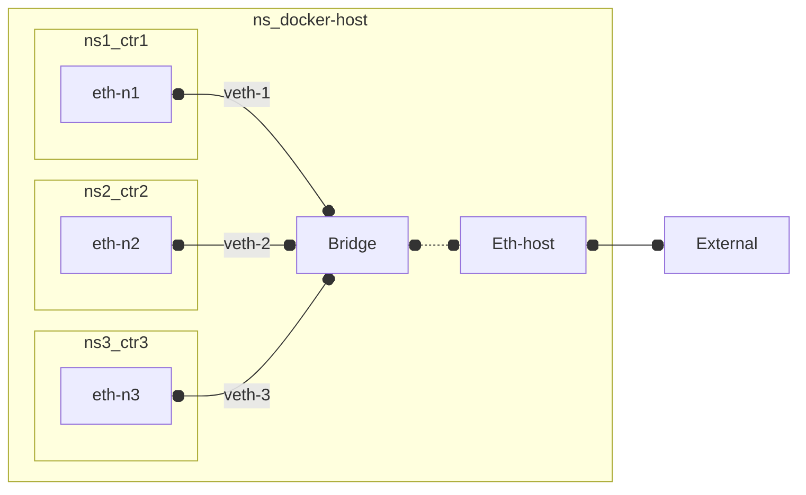

### Docker (*Bridge*) Network
- Docker uses a **`Switch`**  to connect _multiple_ containers on a single host (even though it confusingly calls this a "**bridged**" network - which is technically a 2 port switch).

#####
- It operates at the **Layer 2**. (Data Link Layer) and forwards traffic based on MAC addresses, and allows containers to communicate with each other and with the host system, much like devices connected to a physical switch.

#####
- By default, each docker **container** gets  its own *separate* container **name** and **IP address** (in fact their own **network namespace** [see also](../../../network/interafce.md))
    - unlike in kubernetes where each shares ip address of pod
- Its possible to get containers to **share a single interface** (and ip address) -  by starting a container with option `--net=container:<container-to_share_if_with>`.        
    - ~ what kubernetes does.
#####
- containers can communicate with each other (and with the host) over the _bridge_ (using container names or IP addresses)

#####

#### **Docker Bridge**

---
- Containers in single Kubernetes **[pod](../../kubernetes/ref/resource/pod/pod.md)**, in contrast, all **share** the **same** network namespace