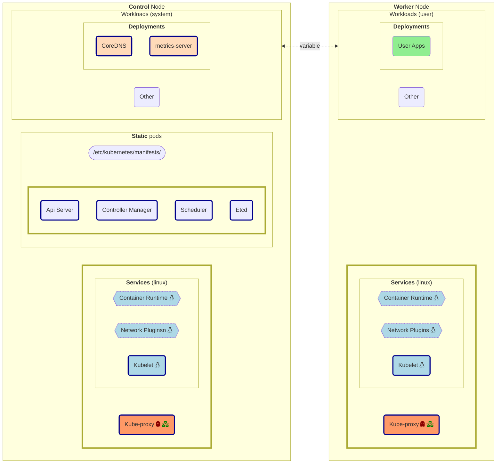

# Kubernetes Architecture

- **Dark Borders**:   
    - **Nodes** individual: core kubernetes (system) components
    - **Groups** of Nodes: run only on nodes as shown
        : cf workloads - system and user  (as shown is usual - but may bbe allowed to vary)
- ##### Kublet 
    - starts/stops all pods on node in question

- ##### Workloads
    - usually run on type of nodes shown, but
        - user workloads may (also) run on (some) control nodes, and 
        - CoreDNS and metric server may (also) run on (some) worker nodeS
    - _Pod start/stop_: **Controller Manager** -> **Scheduler** -> **Kublet**
        (controller manager, delegates to scheduler,  which picks node(s) and delegates to kublet on node in question)

- ##### Non-Workloads
    - only run as shown
        - ##### Static Pods
            - only on control plane
    - _Pod start/stop_:  **Kublet**
        (on node in question, acts independently)

