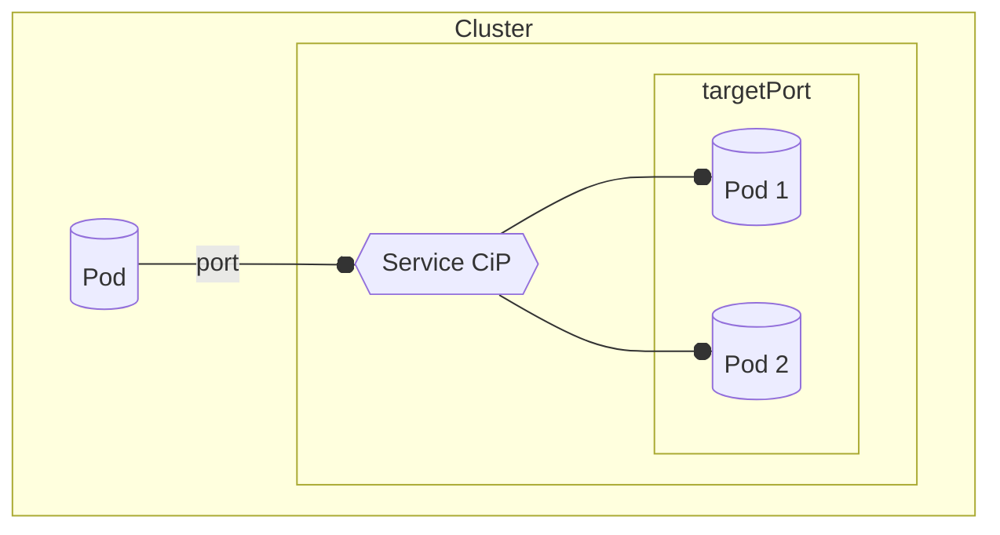

## Cluster IP 
- Stable Ip (as long as service exists) for targeting pods
- Pods targeted are those whose **labels** match the service **selector**
- When multiple pods targeted, one picked at **random** for each new incoming connection
- Accessible from within cluster only.
- Forwards 
    - `service_ip`  &nbsp;&nbsp; &nbsp;&nbsp;  :**`port`** --> 
    - `target_pod_ip`  :**`targetPort`**
        targetPort is **not unique** (cluster-wide, unlike nodePort)
        ***different* services**, (label-based) targeting ***different* pods** can use ***same* targetPort**

        


---

---

#### Service

- `k create` **`service`** **`clusterip`** `my-ser` **`--tcp=8000:80`** -o yaml --dry-run=client > ser.yaml

    - see also [expose](expose.md)
#####
- **ser.yaml**
    ```yaml
    apiVersion: v1
    kind: Service
    metadata:
      name: my-ser
    spec:
        type: ClusterIP         # default

        ports:                  # service can listen on multiple ports - one for each app it "services"

        - port: 8000            # service port - clients target this port on service   
          targetPort: 80        # service targets this port on pod

        selector:             # pods with these labels are targeted 
          app: my-app           # app: my-ser  (default)  - manually edit
    ```

- `k apply -f ser.yaml`


#### Pod
- `k run my-pod` `--image=nginx` `-l app=my-app` -o yaml --dry-run=client > pod.yaml
    - have to use **label** so service can **target**  (cant target on name)
#####
- **pod.yaml**
    ```yaml
    apiVersion: v1
    kind: Pod
    metadata:                   
      labels:                   # service --targets-- based on --labels--
        app: my-app             # <--  this  
      name: my-pod              # cant target based pod name!
    spec:
      containers:
      - image: nginx
        name: my-ctr
    ```

- `k apply -f pod.yaml`

    - `k exec my-pod -- env`     

        ```python
        HOSTNAME=my-pod
        NGINX_VERSION=1.25.4
                                                # services
                                                    
        MY_SER_SERVICE_HOST=10.107.108.124      # ---  my_ser (ONLY if service created BEFORE pod)
        MY_SER_SERVICE_PORT=8000

        KUBERNETES_SERVICE_HOST=10.96.0.1       # ---  kubernetes api server
        KUBERNETES_SERVICE_PORT=443
        ```


#### Query

####

- Service  (**10.107.108.124**:8000)
    - `k get service [my-ser]` `-o wide`
        - `-o wide`  SELECTOR also shown 
        ```yaml
        NAME         TYPE        CLUSTER-IP      EXTERNAL-IP   PORT(S)      SELECTOR
        kubernetes   ClusterIP   10.96.0.1       <none>        443/TCP      <none>

        my-ser       ClusterIP   10.107.108.124   <none>       8000/TCP     app=my-app 
        #                        10.107.108.124               :8000   <-- ip:port  of `my-ser`
        ```
    - `k describe service my-ser`
        ```yaml
        Name:              my-ser
        Namespace:         default
        Selector:          app=my-app
        Type:              ClusterIP
        IP:                10.107.108.124       # 10.107.108.124    clusterIP ip
        IPs:               10.107.108.124
        Port:              8000-80  8000/TCP    # 8000              clusterIP port 
        TargetPort:        80/TCP               # 80                target port   
        Endpoints:         192.168.1.4:80       # 192.168.1.4:80    target pod ip:port  **
        ```
####
- Pods  (**92.168.1.4**:80)
    - **`k get endpoints`** `[my-ser]` 
        ```yaml
            NAME         ENDPOINTS                       
            kubernetes   172.30.1.2:6443            # api server

            my-ser       192.168.1.4:80   #   <---   target pod ip:port  
                                                    # commas sep list, if multiple (running)  (ie match service selector)
        ```

    - `k describe endpoints` my-ser  
        more verbose (only additional info - names of target ports)      
    ###                             
    - **`k describe pod`** `my-pod`
        ```yaml

        IP:               192.168.1.4           # ---** ip address of pod
        Node:             node01/172.30.2.2     # node pod is running on
        ...
        ```
---
### [CoreDNS](../dns.md)
 from inside cluster, you can just use **service name**[.ns] instead of ip address 
- from same namespace:
    - `wget --spider` **`10.107.108.124`** `:8000` ->
    - `wget --spider` &nbsp;&nbsp;&nbsp;&nbsp;&nbsp;&nbsp;&nbsp;&nbsp;&nbsp;&nbsp;&nbsp;&nbsp;&nbsp; **`my-ser`** `:8000`
- from different namespace
    - `wget --spider` **`my-ser.default`** `:8000`     (for  service in ns "default")

---


#### Connect
######  From
- 1). Pod **NOT targeted** by service
    #####
    - `k run tst` `--image=busybox` `--restart=Never` **`[--rm]`** **`-it`**   `-- /bin/sh`
        - **`[--rm]`**   delete pod after terminates
        - **`-it`** wont see output without this
    - `wget` **`--spider`** `my-ser:8000` 

    ####
    - or as single command:
     `k run tst --image=busybox --restart=Never` `--rm` `-it`  **`-- /bin/sh` `-c ` `"wget --spider my-ser:8000"`**


        ```yaml
        Connecting to 10.104.86.159:8000 (10.104.86.159:8000)
        remote file exists
        
        pod "tst" deleted  # because of `--rm` 
        ```


##            
- 2). Pod **targeted** by service
    - `k exec` **`my-pod`** **`-- curl`** `my-ser:8000`
        can connect fine from a pod that service targets too
        ```yaml
        <h1> Welcome to nginx! </h1>
        ...
        ```
##
- 3). **localhost**
    - **`k proxy`** `[--port=8001]` `[&]` 
        - default port: 8001
        - `&` move to bdg to free terminal for next command (or just use different terminal)
        ```yaml
        Starting to serve on 127.0.0.1:8001
        ```
    - `curl -L localhost:8001/` `api/v1/` `namespaces/default` `/services/my-ser:8000` `/proxy`
        
        - `-L` follow redirects        
        - `/proxy` api server should `forward` service at the rest of url 

----
-  *Note:*


    ####
    - same pod(s) can  be targeted by **multiple services** (simultaneously)  

   


         
