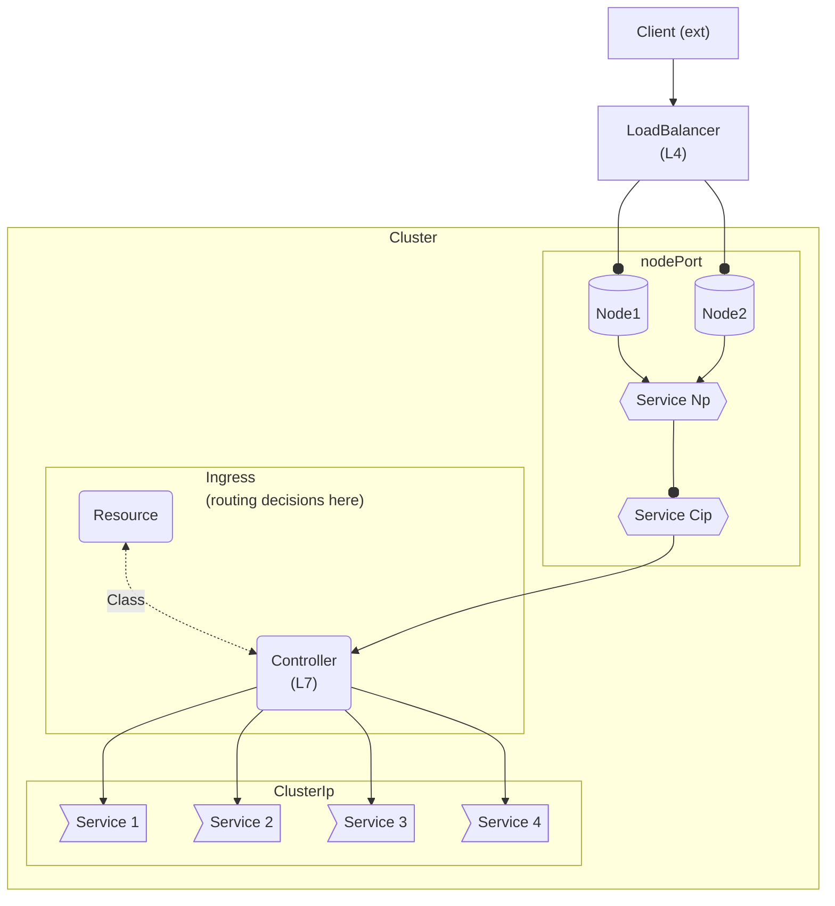

### Ingress
- To allow access to (multiple separate) target  services, from outside a cluster one could 
use multiple nodePort services (with a unique nodePort for each target service).
However routing descisions would be  port only (since all nodes are configured identically and NodePort routes based on port unique alone) 

- Ingress allows for flexible L7 routing (based on host, path, headers, etc)

- Moves the routing decisions behind the single (externally accessible) nodePort service (possibly supported by load balancer)
--- 


---


####
### Resource
- Specifies 
    - **routing rules**  and  
    - **ingress class** 
        - which in turn should point to a (unique type of) controller to use

- unadorned term _"ingress"_ = "**ingress resource**"  

    ```yaml
    apiVersion: networking.k8s.io/v1
    kind: Ingress
    metadata:
        name: next-app-example1
        namespace: ns               # should be same as the namespace of the target service (in `rules` below)
    annotations:
        nginx.ingress.kubernetes.io/rewrite-target: /$1
        kubernetes.io/ingress.class: "nginx-example1"   # deprecated - use `spec.ingressClassName` instead
    spec:
        ingressClassName: "nginx-example1"   # not necessary if a default controller is defined in the cluster?
                                             # should match available object returned by `# k get ingressclass`
    rules:
        -   host: next.example1.com             #  (optional, target) Host header from the incoming HTTP request can be compared to this 
        # when making routing decisions

        - http:
            paths:
            -   path: /app
                pathType: Exact
                backend:
                    service:
                        name: app-service
                        port:
                            number: 8080
    ```


### Class
-  The IngressClass points to the type of Ingress Controller to use. For each (type of) ingress controller (instance), you need a corresponding **IngressClass** resource with a **unique** name
    ```yaml
    apiVersion: networking.k8s.io/v1
    kind: IngressClass                   # unique => "Id" more appropriate than "Class" )
    metadata:
        name: nginx-example1             
                                
    spec:
        controller: k8s.io/ingress-nginx    # ... this controller (type) 

        #--------
        # parameters:
        #   others possible - controller specific
            
    ```


### Controller
- There are various types (implementations) of controllers available (eg nginx, traefik, haproxy aks). Each implementation you wish to be able to use must first be made available to the cluster (usually via helm) 


    -  #### Install 
        instance of ingress controller (and optionally resource) 
        ###
        - `helm repo add ingress-nginx https://kubernetes.github.io/ingress-nginx`
            add repo
        #####
        - `helm repo update`
            refresh cache of charts
        ####
        -   `helm install` to install, or
            `helm template` to just show yaml for resources (~ kubectl --dry-run)

            #### 
            - `nginx-ingress1` 
            what to call the chart (locally)
            #####
            - **`/ingress-nginx/ingress-nginx`**   
                repo/chart to install
            #####    
            -  **`--namespace ns1`** `--create-namespace `
                    separate namespace (optional)

            #####
            - `--set controller.` **`ingressClassResource.enabled`**=`true`
            create resource (kind: **IngressClass**) also (not just controller)
            you must create resource (kind: Ingress) with routing rules manually
            
            #####  
            - `--set controller.`**`ingressClassResource.name`**= **`nginx-example1`**
            IngressClass metadata.**name**  

            ####  
            - `--set controller.`**`ingressClass`**=**`nginx-example1`**
                tells controller what ingress class to use (and from it which routing rules to follow). should match exactly value just set for controller.ingressClassResource.name


            
    - #### Query
        
        - `helm template ~~install~~ .....`
            dont install - just show yaml manifests (~ kubectl --dry-run) 

        - `helm template ~~install~~ ..... | yq e 'select(.kind == "IngressClass")' -`
            just show documents with "Kind: IngressClass"
            (multiple documents (manifests) are output otherwise)
            

        - `helm template nginx-ingress1 ingress-nginx/ingress-nginx --namespace ns1 --create-namespace  --set controller.ingressClassResource.enabled=true --set controller.ingressClassResource.name=nginx-example1 --set controller.ingressClass=nginx-example1 | yq e 'select(.kind == "Deployment")' - | grep -i -C5 "ingress-class=nginx-example1"`
            controller is in deployment resource. show just this, and search for ingress class name that its been configured with


 