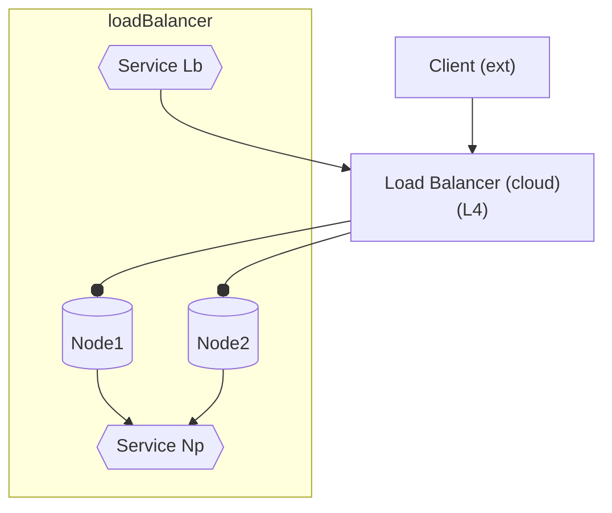

#### Load Balancer


- LoadBalancer creates (or reuses) a NodePort service behind the scenes, which 
can be used directly (just like any NodePort service).

- Requires more than Kubernetes itself offers. Some cloud solutions provide this "extra" (confusingly also called a cloud "load balancer").
    Kubernetes additionally provisions a cloud load balancer behind the scenes to fill the gap. 

    - **Cloud Load Balancer**
        
        - Expensive
        - L3/4 forwarding only (no L7)
            - L3 (ip)  
            - L4 (port) -  effectively distinguishing protocols
            
            - Not **L7** - cant distinguish paths (need ingress for this)
        ###    
        - Balances (matching) nodes.

---

###
---


#### Service
same as  [NodePort](node_port.md), except:

- `nodeport` -> `loadbalancer` in *k create*
- **NodePort**  -> **LoadBalancer** in *manifest*


#### Pod
- same as  [clusterIP](cluster_ip.md)


----

    
#### Query

####
- `k get service my-ser -o wide`  
    
    -   **EXTERNAL-IP** - gets allocated (cf nodePort, clusterIP )
        ```yaml
        NAME     TYPE           CLUSTER-IP      SELECTOR    PORT(S)          EXTERNAL-IP              

        my-ser   LoadBalancer   10.111.21.162   app=my-app  8000:31598/TCP   <pending>
        ```