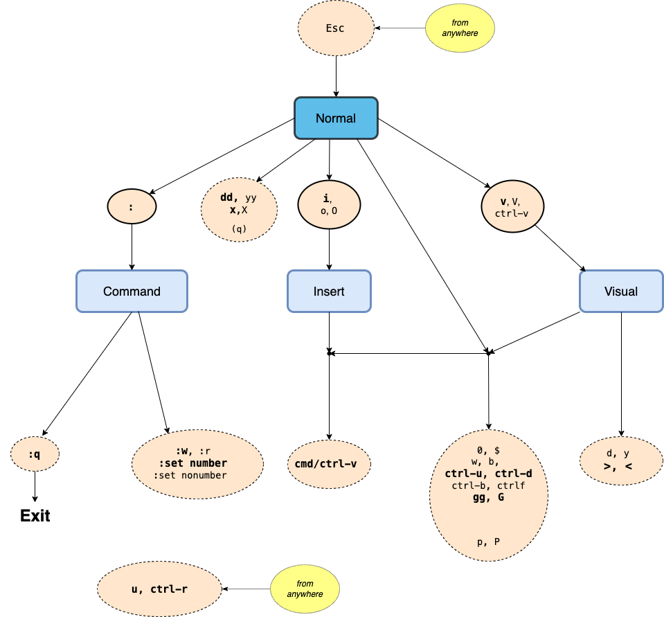

#### Modes 

- **Normal**

    Startup mode. Normal mode can transition to all the other modes and vice versa  (so going through normal - is the only (consistent) way to switch between any other 2 modes
        - `Esc` (enter from any other mode)
####
- **Command**
    - `:`  enter commands
- **Insert**
    - `i` :   type/edit - the _usual_ editor experience

- **Visual** (_Select_)
    - `V`             visual line  (whole lines)
    - `v`             visual 
    - `Ctrl  + v`     visual block  

        #####
        Visual mode is the (only) way you can  **select** text. As a bonus the selected text gets visually highlighted (so _selction mode_ would be a more accurate name). After text is selected you can apply operations to the selected text (eg `y`, `d`,`>`,`<` _see below_)

------
#### Normal Mode

`i`         - _Insert_ mode
- `o`         - line break  **_after_**  current and _Insert_ mode
- `O`         - line break  _before_  current and _Insert_ mode 

`:`         - _Command_ mode

`V`             visual line  (whole lines)
`v`             visual 
`Ctrl  + v`     visual block  

`q` -start/stop recording 
    (_beware_ accidental - hit again to toggle)

##### Edit
- **yank**
    `y`            - yank (ie copy to register) *_selection_* 
    `yy`           - yank _current_ line 
###
- **delete**
    `d`            - delete _selection_ (cut)
    `dd`           - delete line   
    ####
    `x`            - delete (char after cursor)
    `X`            - backspace (delete char before cursor)

####
- **paste**
    `P`            - paste (from prev yank - ie register)  on _current_ line 
    `p`            -  ..... on _next_ line 
    #####
    `Cmd/Ctrl + V` - paste clipboard (os)

###
- **undo**
    `u`        - undo 
    `ctrl-r`   - redo 

####
- **indent** _selection_
    `>`        - in 
    `<`        - out

##### Move
`0`    - start of line
`$`    - end of line

`w`    - forward word
`b`    - backward word

##
`Ctrl+u` - 1/2 page Up
`Ctrl+d` - 1/2 page Down

`Ctrl+b` - page Up
`Ctrl+f` - page Down

##
`gg`   - first line 

`G `   - last line

- **select all**
    `gg`, `V`, `G` - (**move** to first line, enter **visual** _line_ mode, **move** to last line)

------
#### Commands

`:w` - write file 
`:r` - read file

`:q` - quit (after saving)
`:q!` - quit without saving 

`Esc`- normal mode

`:set number` - toggle line numbers **on**
`:set nonumber` - toggle line numbers **off**

