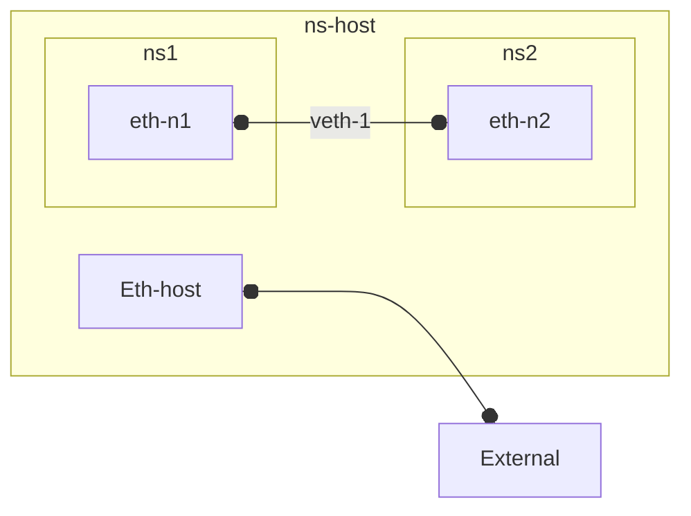

- ### Network Interface 

    - **i/o** for network communication

    #####
    - all **nodes** operating in a network need **at least one** interface.

    #####
    - each interfaces can be in exactly 1 namespace (see below)

    ####

    #####
    - **bridges/switches** 
        - nodes which have **multiple interfaces** all of which must reside within **single namespace** (that of bridge/switch itself).

- ### Network Stack
    Each namespace has its own set of these resources. 
    Confusingly  referred to as a "stack" - **network context** would be a more accurrate term

    - Network interfaces
    - Routing tables
    - iptables rules, 
    - ARP tables, 
    - TCP/UDP port space)
    - IP Network Configuration: 
        - Independent IP addresses
        - subnet configurations
        - ...

--- 

### Network Namespace
- **Stack + Interface**(s) 
    - 1 **stack**  **+** 1 (or more) **interface**(s)
        - on single host
        - **process** **runs** in a network *namespace* and is thus **restricted**  to "*seeing*" only ~ network stack
            #####
            - run my-process in specific network namespace (as opposed to default host namespace)
                - **`ip netns exec`** `my-namespace` `my-process`

        -  seel also **[process isolation](..//devops/docker/tech/process_isolation.md)** 

### Inter-namespace
####
- **veth pair/device** 
    - *software **cable*** that connects interface at one end to an interface at the other (allowing traffic to flow unconditionally) *even* if the interfaces are in **different namespaces**

---
 - **Docker Networks**  
    - Combining veth pairs with bridge, you can effectively bridge between those namespaces. This is how docker connects containers and host in its (default) [bridge network](../devops/docker/main/network.md). 
    - Each **container** gets its own **separate** network **namespace**  (in fact their own network namespace (includig ip address)

- **Pods** 
    - Containers in single Kubernetes **pod**, in contrast, all *share* the **same** network **namespace**

---

