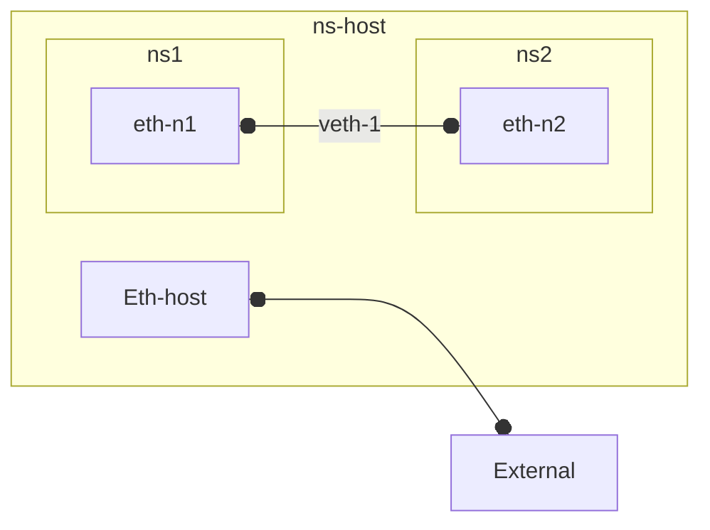
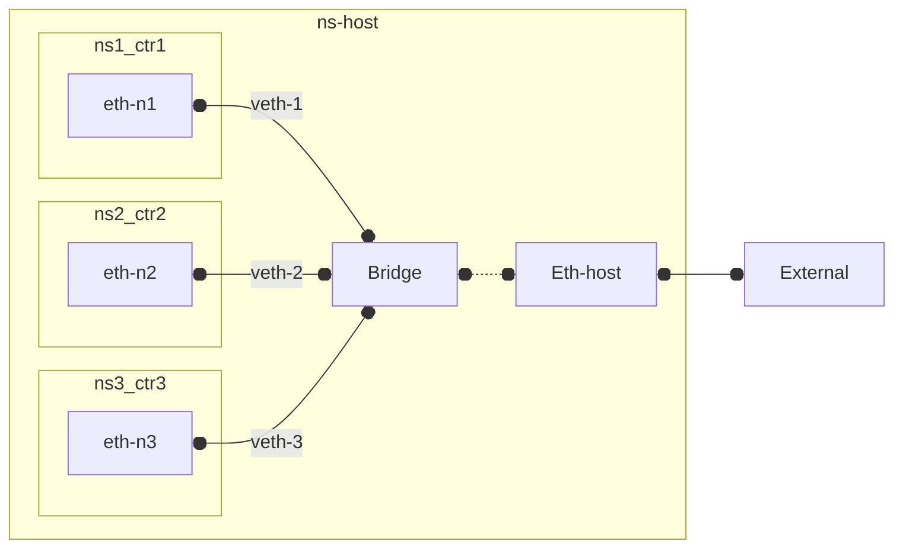

### Network Interface 

- **i/o** for network communication

#####
- all **nodes** operating in a network need **at least one** interface.

#####
- behind every network interface is a **software** *network* **stack** that implements (usually implemented in os) Layer 2 (Ethernet), and also Layer 3, 4 if TCP/IP traffic is to be used.

####

- network **[namespace](..//devops/docker/tech/tech.md)** 
    - on single host
    -  1 software network stack, and 1+ interfaces. 
    - each interfaces can be in only 1 namespace.
    - **process** **runs** in a network *namespace* and is thus **restricted**  to "*seeing*" only ~ network interfaces, and software stack
        #####
        - run my-process in specific network namespace (as opposed to default host namespace)
            **`ip netns exec`** `my-namespace` `my-process`

#####
- **bridges/switches** 
    - nodes which have **multiple interfaces** all of which must reside within **single namespace** (that of bridge/switch itself).

### Inter-namespace
####
- **veth pair/device** 
    - *software **cable*** that connects interface at one end to an interface at the other (allowing traffic to flow unconditionally) *even* if the interfaces are in **different namespaces**

---
 - **Docker-like Bridge**
Combining veth pairs with bridge, you can effectively bridge between those namespaces. This is how docker connects host to shared container namespace. 
    - Although each docker **container** is (by default) assigned its own **separate** network ***namespace***, containers can communicate with each other and with the host over the bridge (using container names or IP addresses)

---
- **Pods**
    - Containers in single Kubernetes **pod**, in contrast, all *share* the **same** network **namespace**

