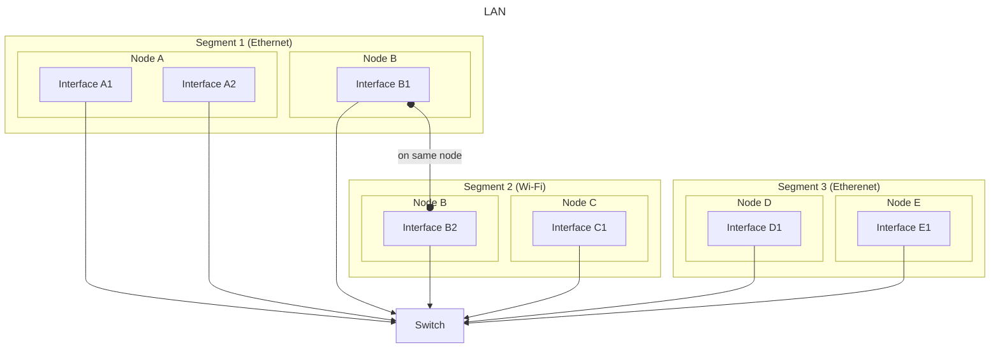
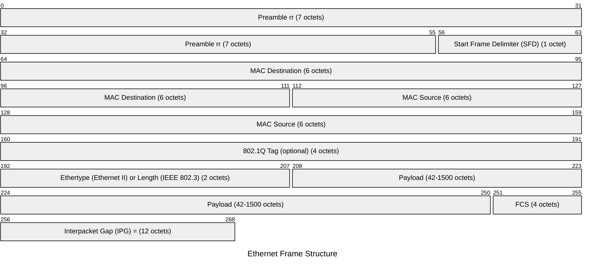

## Network
- A set of **interfaces** (ultimate senders/receivers) that are connected by **infrastructure**, allowing them to communicate by exchanging packets of information with each other.

- Networking (tech) can be seen as a subset of communication (tech - also includes usb, firewire, RS-232 (Serial), bluetooth etc), with more  interfaces, more widely distributed, in more complicated ways (topologies).

- Ultimately nearly all modern network tech is **IP based** (which in turn is nearly always **ethernet** or **wifi** based.

## Node/Device
-  a single _device_ (eg pc) which can contain one of more **ports**

    - _Transparent_ (part of infrastrcuture) if it contains transparent ports (eg switch)
    - _Non-Transparent_ if it has interface ports (eg router, pc)
- on pc ports are usually located on a often on **NIC** (Network Interface Card)

## Port
- i/o point on a node where network packets enter/leave 
- There are 2 kinds of port:
    - **_Transparent_** -  dont have addresses and serve as part of the underlying infrastructure 
    - _Non-Transparent_ (**_Interfaces_**) - have addresses, and are visible to other connected interfaces as src/dst of network packets
- requires (shared) _processing power_ of their device to send/receive packets

## Interface 

- are connected by infrastructure (media and transparent devices) interfaces form a network
- has an address, which (uniquely) identifies it on the network

- interfaces are **addressable ports**, whereas non-addressable ports are _transparent_ and serve as part of the infrastructure.
- devices allow ports to share the _processing power_ they need (eg shared resources such on network card (NIC) with multiple slots or antennas)
    - the interfaces of a given node may be on separate (independent) networks
    - "interface" will be used here to refer to the actual interface + the shared resources ("network stack") it gets from the node

- ### Broadcast Domain
    - The set of interfaces a packet reaches when an interface sends a (broad-, multi- or unicast - see footnote) packet intended for all other connected interfaces.

- ### Collision Domain
    - The set of interfaces a packet reaches when an interface sends a packet intended for one or more specific interfaces. The smaller the collision domain (beyond the intended destination interfaces) the better.

## Infrastructure
-  Media (eg cable)
- Transparent devices (eg switch)

---
###
## Layers

When discussing network concepts it common (eg OSI and TCP/IP models - more later) to divide the topics into separate layers of abstraction
- **Layer 1**: covers the streaming of bits between interfaces along a (single) connecting medium.
- **Layer 2** is all about **packets** 
    - i). **Protocol**  
        - the (in memory) **structure** of individual packets
    - ii). *converting* packets to/from **bit streams** at interfaces

----
# Layer 1

### Segment 
- A **single medium** and all interfaces it connects
    - (*Link* sometimes used as synonym for segment with point-point connection)
- These interfaces form a **single collision domain**
- Each interface can be connected to at most 1 medium, and thus part of at most 1 segment (at any tine)
- The collision domain of a single isolated (ie not part of LAN - see below) segment, is identical to its broadcast domain. 

### Medium

- _Unconditionally_ connects all interfaces attached to it, so that every packet sent by  any interface arrives at ever other interface attached to said medium. One speaks of the interfaces being in a single **collision domain**  - since when two interfaces try to send packets simultaneously they "collide" resulting in communication difficulties.

- Media used in modern networks are almost exclusively:
    - voltages down (Ethernet) **Cables** 
    - radio waves through (WiFi)  **Air** 
    - infra red waves along (Optic) **Fiber** 

    Note: Ethernet and Wifi are standard that govern not just layer 1 (media) bit also layer 2 (protocols) - see below

#####
-  Connection via single medium can be: 
    - **Point-to-point**
        - When exactly 2 interfaces are connected 
        - by a single cable/wire (**not shared** with any interface, other than these 2)
        - Full-duplex - 2 (or more) channels - (at least) one for each dirn packets travel -  avoids the collision problem.
        - Roles can be 
            - asymmetric: eg **master-slave** 
            - symmetric: **peer-to-peer** 

    

    - **Bus**
        - When more than 2 interfaces are connected
        - Such a shared medium is also called a **bus**
            - Classic ethernet Bus (legacy)
            - Wireless
        - More interfaces attached => more potential (collision) problems.
        - Half- duplex: "transmit if quiet - backoff on collision"

        ####
        - _Multipoint_ connection is more general, and may involve multiple media (of same type). A bus is a multipoint connection over a single medium

--- 

# Layer 2

## Packet
The smallest in-memory unit of data that gets transformed into a bit stream before sending, or assembled from a bit stream after receiving, at an interface. It is subdivided into:

- **Header**
    - **Source Address**
    - **Destination Address**:
        - **Unicast**
            - The address of a specific existing interface
                - a specific value (usually all **0s**) is reserved to mean  _address unknown_ - rarely useful
        - **Multicast**
            - An address within a reserved range, representing a group of interfaces configured to know they belong to that group.
        - **Broadcast**
            - An address representing all connected interfaces, usually all **1s**.

    - Other **meta** information used to facilitate reliable (e.g., error checking) and efficient transmission.

- **Payload**
    - The actual body of information the sender wishes to deliver.

- layer 2 packets are often to referred to as **frames**
    

## LAN - Connected Segments
A single port can be connected to at most one medium, and thus be on at most one segment. But different ports on a **single node** can be on different media/segments. Such a node could **bridge** (join) the 2 segments (even if they are using different L1 standards eg different media types) 

- when a packet arrives on a port from one segment, with a destination address of an interface in the other segment (or the broadcast address), the node could simply **forward** (resend) it on its **other port** (connected to the other segment).

**LAN** is the term for multiple segments (with individual broadcast domains) thus joined into a **single larger broadcast domain** (while retaining their **original isolated collision domains**)

- ### Home Router 
    - A typical home router integrates both individual point-to-point (Ethernet) cable segments and (wireless bus) multipoint segments (Wi-Fi) into a single Layer 2 LAN.
        - the ports in question are interafaces 
        
- ### Switch 
    - When the node has more than 2 interfaces dedicated to this purpose, its called a **switch**. Modern switches are highly sophisticated configurable devices, and its not uncommon for it to have more than enough interfaces so that all others in the LAN can be connected to it via individual point-to-point (duplex) cables.  Thus eliminating the collision domains while maximizing the broadcast domain. 

    #####
  
    - If desired the switch can be configured to _subdivide a LAN_ into separate LANs (broadcast domains) which are often called **VLAN**s. 
        - (Note: For most intents and purposes a VLAN is just a LAN. The fact thatst its created by a switch configuration, doesnt change the network behaviour (at layer 2 at least) - so where theres no reason to maintain distinction, from now on, term _LAN_ can be understood to also include _VLAN_)
    
    #####
    - **CAM** (Content Addressable Memory)  ***Table*** of a switch
        - maps address of each (connected) interfaces to ports on the switch
        - in LAN with _multiple switches_, the CAM table of each switch will have some ports (those connected to other switches) mapped from multiple addresses (those "behind" the other switches)
            
    #####
    - When a switch receives a packet for whose dest address it does not have an entry in its (CAM) table it floods the packet - ie resends it on every port within the respective broadcast domain except the one through which the packet arrived. 

    #####
    - The switch learns MAC addresses _only_ from the source addresses of incoming frames, which it uses to keep its CAM table up to date

    #####
    - Can use **buffering** to avoid multiple simultaneous signals to same dest.

---

###

---- 

### Protocol 
Every physical layer typically has a corresponding layer 2 **protocol** that is **native** to it. However, this protocol can, in principle, be used in other (higher) layers as well (more later). For example, Ethernet protocol, which is native to layer 2, can be encapsulated and used over IP (_Ethernet over IP_), demonstrating that these protocols can operate beyond their typical layer.

-  Wifi protocol is very similar to Ethernet protocol (but adds some extra features eg for signal strength, encryption)

- Optic Fibre typically uses Ethenet protocol
---- 

Footnotes:

- **Hub**
    - Behaves like a switch with an empty CAM table, resending incoming packets on every interface except the one through which the packet arrived.
    - With 2 interfaces, it can be used to extend the physical range of a connection by boosting the signal.
    - With 3 or more interfaces, it effectively creates a Bus (see above).
    - Rarely used in modern networks.

###
- **Bridge**
    - A switch with 2 interfaces.
    - Rarely used in modern networks.

####
- **Multilayer Switch** 
    -  Can do all a switch can, and additionally
    -  **route** but only between VLANs connected (directly) to the switch.
        - which means no best path calculations necessary (one of main features of production routers)
    - Some very high end:
        - Generally logic implemented in hardware (ASIC) 
        -  faster but less flexible (not all routing protocols supported), but more expensive than router (which generally uses software coded logic). 
    - Some not:
        - home routers
            - like a switch with a single route (to ISP)

####
- **Broadcast Domain**
   - Its in principle possible to configure at switch so that the set of interfaces that can reach each other via broadcast packets, is different to that which can reach each other directly (unicast and **multicast** packets).  This book will consider them identical and use the term "broadcast domain" to to refer to both.

###
- **Circuit vs Packet Switching**

    - Circuit Switched: 
        - A dedicated VLAN (circuit) is established for the 2 interfaces before they start communicating (confusingly also using "packets"- but they no longer need addresses in the headers)

        - **Example**: 
            - **PSTN** (Public Switched Telephone Network) uses circuit switching - a dedicated communication channel is created for the duration of a conversation.
        However, PSTN is increasingly being replaced by more efficient packet-switched technologies (e.g., VoIP, or telephone over IP).

    ###
    - Packet Switched:
        - No dedicated VLAN is necessary. The usual case in modern networking  

###
- **Sockets**
    - are the way the os gives (user) applications access to packets (more later)

###
- **Packets**
    - are sometimes also called 
        - `Protocol Data Units` (PDUs), or
        - `Frames` (in the context of ethernet)
---

Optional:

-  #### Topology 
    Each segment type ~ **fundamental** topology
    - more complicated topologies can be formed by joining segments using devices
        - **Physical** topology
            - when you include all devices in the view of the topology
        - **Logical** topology
            - when you omit transparent devices from the view of the topology

        #### 
        - _Note_: A given physical topology (eg _star_ with switch at center) may correspond to a different kind of logical topology (_mesh_ - interfaces dont "see" the switch)

---

#### Peer-to-Peer
A kind of point-to-point communication where devices have equal roles, meaning there is no central controlling entity (e.g., no master-slave relationship)

----

#### Implementations and Standards
 Various implementations of layer 1 and 2  exist  and standards have been agreed upon to ensure consistency and quality  

- ##### Ethernet
    - Standard `IEEE 802.3`
        - covers all of layer 1 and 2 (with wired media)
            - Layer 2 coverage is subdivided into:

                ######
                - 1). **Ethernet Protocol (LLC)**  definition and composition of valid frames (including addressing, framing, and error-checking mechanisms)
                
                ######
                - 2). **MAC sublayer**: hardware necessary to be able to pull bits off wire and push them on. manages access to the network and controls when and how data is sent or received over the physical medium. includes collision detection, backoff algorithm (CSMA/CD protocol) 

###

- where
    - FCS : Frame Check Sequence
    - IPG: Interpacket Gap
        - silence on wire (carrier with no modulation)
            - which is different to encoded "0"s
    - 2 octets (semantics):
        - Ethertype (Ethernet II): if value ≥ 1536
            - identifies the protocol encapsulated in the payload (e.g., IPv4, IPv6, ARP).
        - Length (IEEE 802.3) : if value: ≤ 1500
            - represents the length of the payload in bytes.

- ##### Wifi 
    Standards  `IEEE 802.11...` for wireless communication

## Binding (Application/Socket)
Several mechanisms exist for associating an incoming packet with a particular application (more precisely, a socket thereof - see below) that wishes to receive it.  A single socket may however avail of at most one mechanism.

#####
- 1). `Protocol Id` 
    - A field a few bytes long in the header of packets reserved for associating the packet with a `protocol`. 
    (Note: the layer 2 protocol is not meant here (but rather a higher level, or virtual one). 
    - In the case of Ethernet this field is called `EtherType` (and is 2 bytes long)
    - An application can register itself as the handler for packets with a specific `Protocol Id`.
    - A few values correspond to  (existing) standard protocols (eg IPv4, ARP) and packets arriving with the corresponding Protocol Id in the header, are passed on to the OS and the the sockets/applications it wants handling them.
    - All other values are "custom" and are available to be "claimed" by any (single) socket - effectively registering that socket as the handler for packets with this custom Protocol Id.

#####
- 2). `Packet Filter` (eg BPF) - each application can create and register a (custom) packet filter that each incoming packet gets passed to. It checks the packet (header and/or payload) for a match (the application/filter is free in deciding what to deem a match). If the filter deems the packet a match, then said application receives the packet.

#####
- 3). `Promiscous Mode` (application gets a copy of all incoming Frames)
        - Often used by debugging/analysis tools like [Wireshark](https://www.wireshark.org/)

##
- Example scenario: 
    - Packet `p` with `Protocol Id` `v1` is incoming:

        - `a1`: In promiscuous mode, receives all packets.
        - `a2`: Bound to `Protocol Id` `v1`, receives packet `p`.
        - `a3`: Filter matches packet `f`, receives packet `p`.
        - `a4`: Filter matches packet `f`, receives packet `p`.

    - All four applications (`a1`, `a2`, `a3`, `a4`) receive a copy of the packet `p`.

