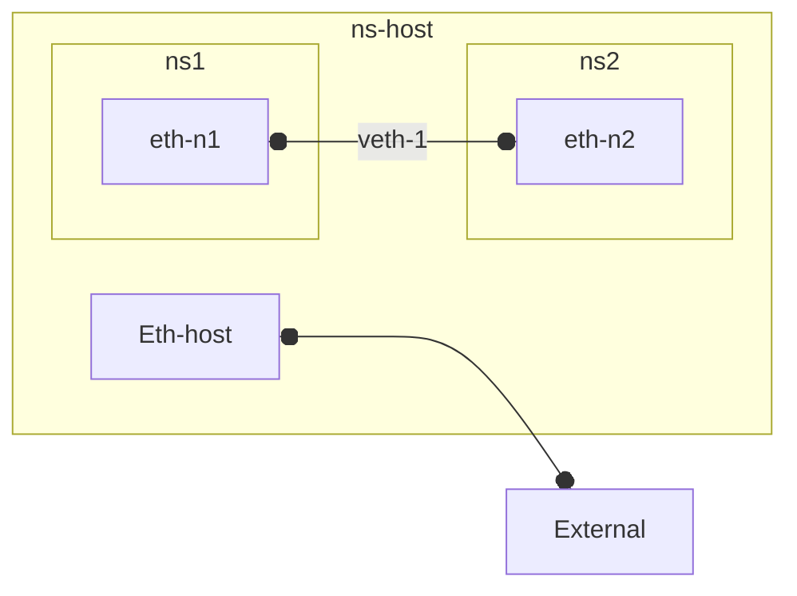

### Network Namespace
Each Network [namespace](../../cloud/devops/docker/tech/namespace_types.md) has exactly one network stack.
It isolates **userspace** (socket) **access**  to network resources (interfaces, routing tables, and IP addresses etc) in the ~network stack. Each network namespace provides a separate instance of the network stack. This means that processes within one namespace see only the network interfaces, routing tables, and other network-related settings that belong to that namespace.

- #### Network Stack
    
    - **network context** would be a more clear term

    ####
    - Contains a set of these resources:

        - **Interfaces**
        - **Bridges**, **Switches**
        - **Routing tables**
        - iptables rules, 
        - ARP tables, 
        - TCP/UDP **port space**
            - If you have a web server running in Namespace A listening on TCP port 8080, you can also have a different web server running in Namespace B on TCP port 8080. These servers will not interfere with each other because they are in separate namespaces with isolated port spaces.
        - IP Network Configuration: 
            - Independent IP addresses
            - subnet configurations
            - other related network settings

    ##
    - Note: each interface, and each **bridge/switch** (which have **multiple interfaces** all of which must reside within **single namespace** - that of bridge/switch itself) can be in exactly 1 namespace 

    ####
    - on each host
        - each  **process** **runs** in a single network *namespace* and is thus **restricted**  to **seeing** only network stack of that namespace 
        #####
        - to run my-process in specific network namespace (as opposed to default host namespace)
            - **`ip netns exec`** `my-namespace` `my-process`

    ##
    -  see also **[docker process isolation](../..//cloud/devops/docker/tech/process_isolation.md)** 

##
### Inter-namespace
####
- **veth pair/device** 
    - *software **cable*** that connects interface at one end to an interface at the other (allowing traffic to flow unconditionally) *even* if the interfaces are in **different namespaces**

---
 - **Docker Networks**  
    - Combining veth pairs with bridge, you can effectively bridge between those namespaces. This is how docker connects containers and host in its (default) [bridge network](../../cloud/devops/docker/main/network.md). 
    - Each **container** gets its own **separate** network **namespace**  (in fact their own network namespace (including ip address)

- **Kubernetes Pods** 
    - Containers in single Kubernetes **pod**, in contrast, all *share* the **same** network **namespace**. This means they have the same IP address, so you differentiate the TCP/IP traffic between containers using different **port** numbers. And containers in same pod can communicate with each other using **localhost** (and container specific port)

---

