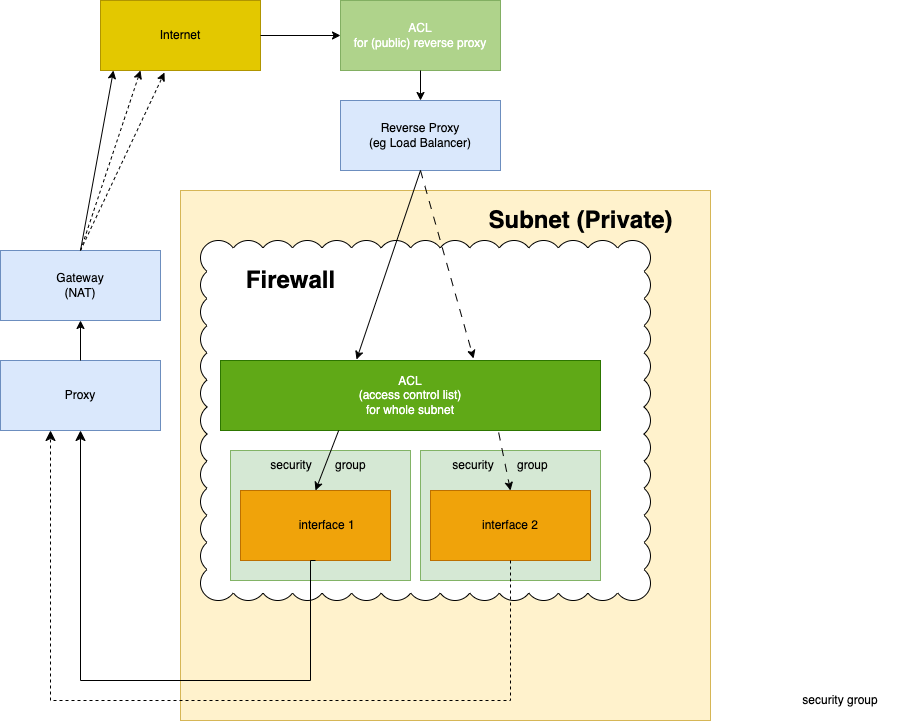

- #### Subnet

    - **Private**
    Creating (private) subnets allows you to use private ip addresses for all resources in the subnet, though which they can freely communicate with each other but the rest of the internet cant access or vice versa. NAT is then required.

    - **Public**
    Subnets can also be public, in which case theres no need for NAT (but a gateway is still generally used). Because interfaces have public ip addresses its more insecure - easier to bypass any ACL 

####

- **LoadBalancer** is a kind of **Reverse Proxy** (a reverse proxy  can in general do more than just load balancing eg caching, compression etc)

- **Gateway** routes outgoing traffic

    - **NAT** is a kind of gateway that provides necessary address (private to public) translation (that the reverse proxy needs to "undo") for traffic existing a _private_ subnet

- **Proxy** can cache web pages, improving performance

###
- **Security Group** Each interface in the subnet generally has its own security group, which restricts both ingoing and outdoing traffic. Security Groups basically govern whether TCP connections may be established (one speaks of security groups being _stateful_), and once established all traffic thats part of the connection is allowed

- **Access Conrol List (ACL)** each subnet shares one, and the reverse proxy may have an additional one

##

