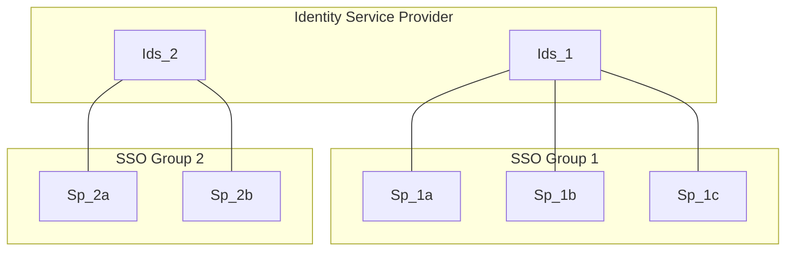

### Federated Identity Management (FIM)

-  Authentication is implemented by a separate 
    - **identity provider (IdP)**, which is accessible and trusted by multiple 
    - **service providers (SPs)**. 

- Each SP handles its own authorization for the user, who is authenticated (identified) by the IdP.

- The IdP can service multiple independent groups of Sps 
- Sps in any group (eg Group 1) can only access identities (Ids_1) stored for that group 

---
#####
- **[OAuth](https://frontegg.com/blog/oauth)**  is used for authorizing an established identity at any SP.

    - **OpenID Connect**  is used for initially establishing identity by the first service provider (SP), and subsequently sharing of the established identity among the SPs. Often the term "OAuth" is (inaccurately) used to include OpenID Connect

#####
- **SAML** is an alternative to the _OAuth + OpenID Connect_ combination. Its uses **certificates** and **xml** instead of signed tokens for information transfer, and is more heavyweight and difficult to implement. Its more  more common in corporate networks, than typical web application where OAuth is typical.

- #### Single Sign-on
    - SSO uses FIM to avoid the user having to log on to more than one of the SPs in a "group" in order to use the services of all. 

    ###
    - It does so by saving a (session) **cookie** in the users browser, as well as returning the necessary identity **token**. This cookie gets resent automatically on any further request to the IdP, which it uses to determine that the user in question is already authenticated. Each Sp in a group gets its own access token, but user doesn't need to resubmit their credentials (username password), for them to get it.

    ####
    - The use of a cookie here creates an opening for  [CSRF](browser_security.md), not in that a 3rd party site can hijack the session of one of SPs - it cant  access their identity token, but it could in principle use the cookie to _obtain a token of its own_.

    - #### Social Sign-on
        - **_"Log on with Github"_**
            - Esentially SSO where there is just one SP involved. The IdP (eg github) provides the authentication (identification management) service for the SP, saving it from having to implement its own authentication system.

            - Note: That since there is only one SP involved, there is **no** need to save a **cookie** locally, and thus not the the same susceptibility to **CSRF**, as with SSO

        