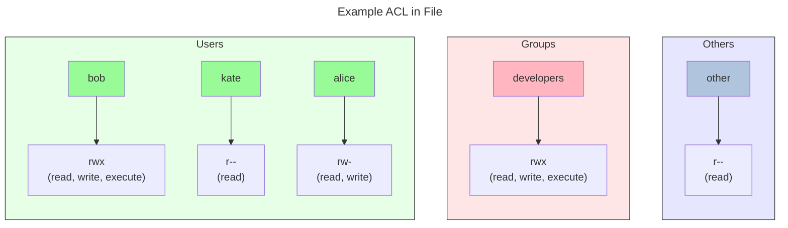

### Access Control Lists (ACLs)


_Extends permission modes_ of file/dir (which allow setting access permissions on file/dir for owner, group and other of the file/dir) to allow setting (individual) _access_ **permissions** to **arbitrary users and groups**.



- The effective permissions a process gets, are the most restrictive set of permissions derived from (combining) both the ACL entries and the traditional Unix permissions.

---

### ACL Commands

`setfacl` and `getfacl` commands are used to set/get acls on specific files/dirs

- Set ACLs
    - **`setfacl`** **`flags`** **`entry`** `<file_or_dir_path>`

        - `flags`:
            - **`-m`**: modify/add entry
            - **`-x`**: remove entry
            - **`-b`**: remove all entries
            
            ######   
            - **`-d`**: set default (directory only)
            - **`k`**:  remove-default

        #####
        - `entry`:
            - `(`**`u`**`|`**`d`**`)` `:<(username|groupname)>:` **`[r][w][x]`**

###
- Get ACLs
    - **`getfacl`** [`flags`] **`entry`** `<file_or_dir_path>`


##
##### Examples
```bash
# Give user bob read & execute permissions on file
setfacl -m u:bob:rx file.txt

# Set default ACL on directory - all new files inside will inherit:
# group 'devs' gets read & write
setfacl -d -m g:devs:rw dir/

# Multiple ACLs in one command:
# - user bob gets read & execute
# - group devs gets read & write
setfacl -m u:bob:rx,g:devs:rw file.txt

# Show all ACLs on file
getfacl file.txt

# Remove just bob's ACL entry
setfacl -x u:bob file.txt

# Remove all ACL entries (back to basic unix permissions)
setfacl -b file.txt

# Remove all default ACLs
setfacl -k dir/
```