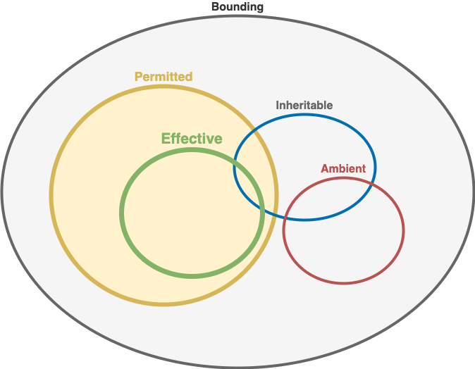

# Linux Capability Sets

A process's capability sets are used as part of the general [permission checking mechanism](permissions.md), when a process tries to perform an action (on a file).  A process has 5 capability sets 
- **Effective (E)**: Active capabilities that determine what a process can do.

- **Permitted (P)**: Set of capabilities a process can acquire.


#####
- **Bounding (B)**: Upper limit on all capabilities.

#####
- **Inheritable (I)**: Just used for inheritance calculation.
- **Ambient (A)**: Just used for inheritance calculation.


Only the Effective set is used to determine whether the process can perform an action. The other sets are used (in conjunction with the file's two capability sets) to determine what capabilities a child process inherits when the action is *execute*.

A process can dynamically choose to (temporarily) drop Effective capabilities or re-acquire them from the Permitted set at any stage, thereby *opting in/out* of capabilities (_principle of least privilege_).


<div align="center">

</div>

## Process


Key rules:
- A ⊆  (I ∩ P)  
- E ⊆  P
- B ⊇ all others

## File
Used (only) in calculating capabilities of sub process. 

- **Permitted (Pf)**
- **Inheritable (If)**
- **Effective Flag (eflag)**

## Child Process Inheritance
- Pc = (P ∩ I) ∪  (Pf ∩ B) 
- Ic = I ∩ If

- Bc = B

- Ac = (uid != 0)? A : {}  // ie non-root
- Ec: (eflag? Pc : {}) + Ac  

---
##### Set notation:  
`∪`: union  
`∩`: intersection  
`⊆`: subset  
`⊇`: superset
`{}`: empty set

---

#### Examples
##### View capabilities
- **`getcap`** `/usr/bin/ping`
    ```yaml
    /usr/bin/ping = cap_net_raw+ep
    ```

##### Set capabilities
- **`setcap`** **`cap_net_raw`** `,cap_net_admin` **`+ep`** `/usr/sbin/tcpdump`

    - verify:
        - `getcap /usr/sbin/tcpdump`
            ```yaml
            /usr/sbin/tcpdump = cap_net_admin,cap_net_raw+ep
            ```

Thy syntax is confusing - difficult to remove just certain capibilites - you have to set all you want each time 

###### Notation:
`+ep` = effective and permitted sets
`+p` = permitted only
`+ei` = effective and inheritable
....
