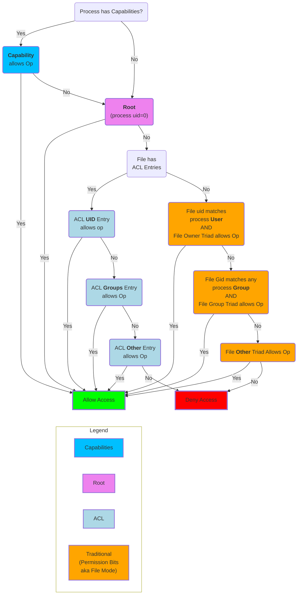

### Permission Checks - for Process trying to act on File

The logic of the [permission checking](permissions.md)  when a process tries to perform and action on a file:



###
```bash
# Capabilities check
if (process has any (permitted) capabilities set)
    if (one of these capabilities permits the operation on target file)
        allow access;  // using capabilities limits even root access
else if (user is root)
    allow access;

# ACL check
else if (file has ACL entries)
    if (an ACL entry for the effective UID permits the operation)
        allow access;
    else if (an ACL entry for one of the process’s groups permits the operation)
        allow access;
    else if (an ACL “other” entry permits the operation)
        allow access;
    else
        deny access;

# Traditional (permission bits) check:
else if (process’s effective UID matches file’s owner,  AND file owner’s permission allows the operation)
    allow access;
else if (process’s effective GID matches the file’s group OR any of its supplementary groups matches, AND file group’s permission allows the operation)
    allow access;
else if (file’s “other” permission allows the operation)
    allow access;
else
    deny access;
```

