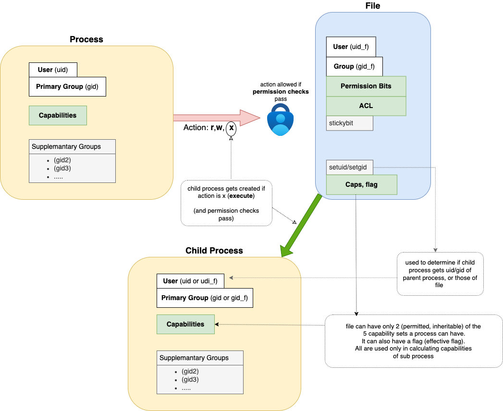

### Process Permissions

The permissions of a **process** - always means **what action it can perform** (read, write, or execute) on  a specific  **target file** (_everything in linux is a file_: see also [file descriptor](../architecture/architecture.md) and [shell](../startup/shell.md)) 

These checks use a combination (green boxes above) of process: [Capabilities](capabilities.md), and target file: [Permission Bits ](traditional/traditional.md) and [ACL](acl.md) 

        
If the action is _execute_ (and it passes the permission checks), then a **child process** is created, which usually inherits the uid and  gid of the parent process (but this may be overridden if  `setuid`/`setgid` in the file).

##
##### Permission Checks

 See [permission_checks](permission_checks.md) 

