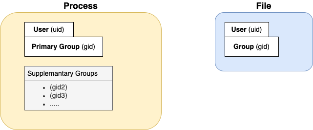

### Users and Groups

Every process and every file has a user and group associated with them.
(A process can have additional - supplementary  groups)
#

When a process creates a file (or another process), the file (or child process) is assigned the process’s user and primary group (by default - see also [permissions](../permissions.md)).