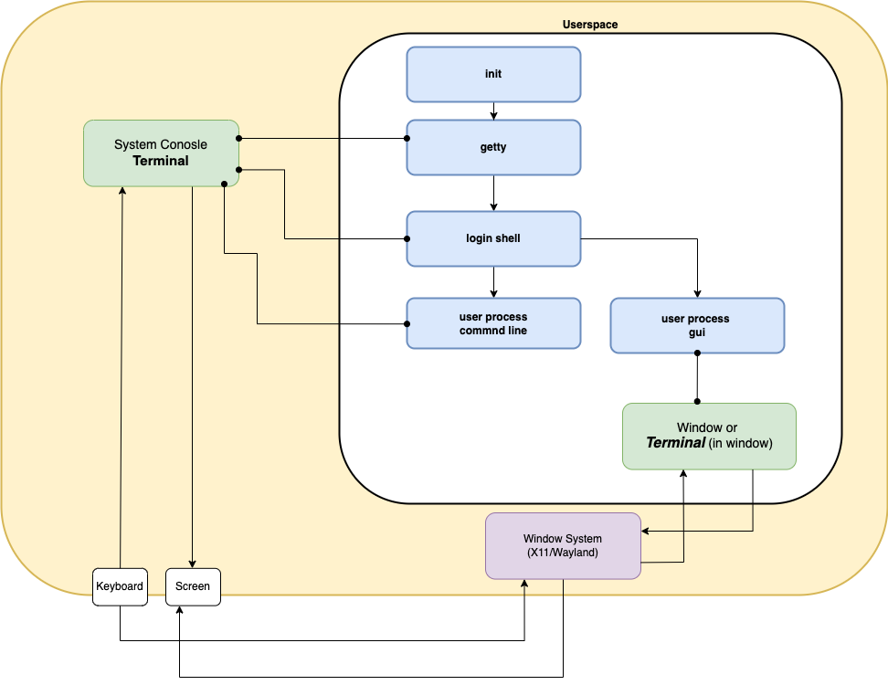

## Standard Streams and Terminals



### Standard Streams

Every process (including shells), have 3 standard streams:
- `stdin`
- `stdout`/`stderr`

Each of these can independently be connect to various endpoints:

- **Terminal**
- **File**
- **Network stream**
- **Process stream**, of other process (ie `pipes`)

By default the login shell and all non-gui children have its streams connected to they system console (terminal). Gui processes can _emulate_ a terminal using the window system 


## Terminals

Can be either system consoles created by the kernel, or terminals that are created in userspace and use the window system.
(The later are sometimes called _pseudo terminals_, since they dont interact directly with the screen and keyboard but go use  the window system to _emulate one_)

- Receive input from a **keyboard**, and write it to a program (which has the terminal configured as its **stdin**)
- Receive text from a program (which has the terminal configured to be its **stdout** or **stderr**) and write to the **screen**. The text can be a mixture of (printable) characters to display and escape codes.

- ##### Escape Codes
    Escape codes are special sequences of characters that start with the "escape" character (ASCII 27, often written as `\033` or `\x1B`). They signal to the terminal that what follows isn't text to display, but rather instructions for how to display things.

    A simple example:
    ```bash
    \033[31m      # Set text color to red
    Hello World   # Normal text to display
    \033[0m      # Reset formatting back to default
    ```

Most terminals differ only superficially. The real difference in sophistication is in the applications (eg vim) that use the terminals. 


