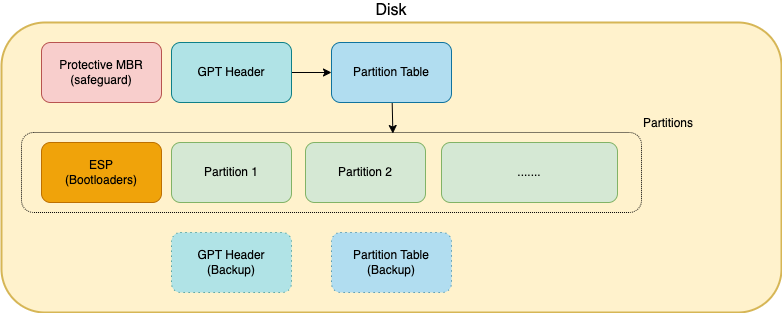
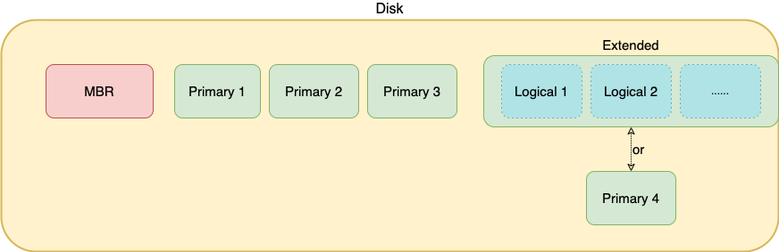

### Disks and Partitions

#### Partitioning Scheme
 This defines how the storage space on a disk is divided into **partitions**.

The two main partitioning schemes are:

###
- ##### 1) GUID Partition Table (GPT)
    - Modern 

    ###
    

    ######  
    - Can divide a disk up into many (typically 128) partitions. 

    
    ######
    - **ESP** (EFI system partition), is always formatted with `FAT32` and is typically 100-500MB. It contains all bootloaders for the disk in their entirety.

    ######
    - The **bootloader** for any partition that should be made bootable gets installed into its own directory in the ESP e.g.
        - `EFI/Microsoft/` 
        - `/EFI/Ubuntu/`

    ######
    - _Modern_ - can only be used for booting by UEFI boot systems.
    (After boot by UEFI, os can read partitions on any additional MBR disks fine though)

#
- ##### 2) Master Boot Record (MBR)

    - Legacy

    ###
    
   
    ######
    - _Legacy_ - can be used for booting by BIOS or UEFI (in compatibility mode) boot systems.

    ######
    - Each disk can have up to four **primary partitions**, or three primary partitions and one **extended partition**, which can in turn contain an arbitrary number of **logical partitions**.
    ######
    - The partition tables is stord in the MBR
    ######
    - Partitions are bootable on MBR disks if they have a first stage boot *record* (containing the bootloader) in their first sector.
    The first stage bootloader hands off to a second stage bootloader located at the start of each bootable partition.

    ######
    - Only linux can boot from logical partitions

x

