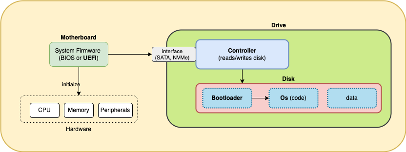

### System Boot

- #### System Firmware 
    The system firmware on the motherboard  

    - initializes system _hardware_   
        - including cpu, memory and peripherals eg (PCI) network cards, and
    - ##### OS Bootloader
        The system firmware uses the controller on the startup drive to find and execute the os _bootloader_, whose sole job it is to _find and load the os_
        - The bootloader can load an os from (a partition on) the same or a different (connected) disk 
        - The details of the bootloader and how it locates and loads the os depend on the [partitioning scheme](disks_and_partitions.md) used on the disk

    ####
    - after the os loads, it can access partitions on any (connected) disk independently (of system firmware) using the disk controller directly

    ###
    There are 2 main kinds of system firmware in use:

    ####
    - ##### 1)  Unified Extensible Firmware Interface (UEFI)
        A more modern system firmware. A UEFI system can boot from disks partitioned with either MBR (using a Compatibility Support Module (CSM), which emulates BIOS behavior) or GPT (in native UEFI mode). If a UEFI system wants to boot from a [GPT](disks_and_partitions.md) disk, it *must* be in native UEFI mode.

    - ##### 2) Basic Input/Output System (BIOS)
        An older system firmware. When a computer has a BIOS firmware, the system firmware can only initiate the boot process from a disk that has been partitioned using the Master Boot Record (MBR) [scheme](disks_and_partitions.md).

    #####
    A computer will have *either* a BIOS (legacy) *or* a UEFI (modern) firmware, but not both.
        

