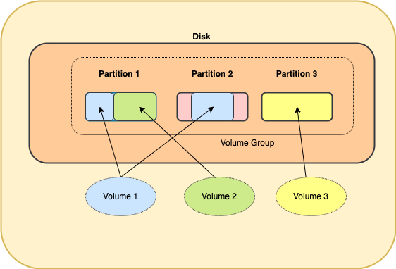
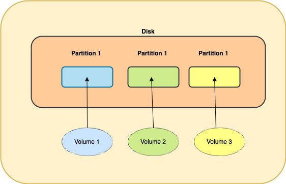

- #### Volumes

    - Volumes are how an operating system presents [disks](disks_and_partitions.md) to userspace.
    - They are formatted with a single **file system** and cant contain special partitions (eg [esp](disks_and_partitions.md)) or sectors (eg [mbr](disks_and_partitions.md))
    
  #####
  There are two types of volumes, each of which can be used _independently_ of the  [partitioning scheme](disks_and_partitions.md) (GPT or MBR) used to partition the disks.

    ####
  _Note_: MS Windows incorrectly refers (eg in windows explorer)  to _volumes_ as [drives](./overview.md)

    ##
    - #### 2) Logical Volumes (LV)
    
    
          

        #####
        Modern volumes, used as part of Logical Volume Management (LVM) and

        - Can be composed of (parts or the whole of) multiple partitions (on one or more disks). 

        - Partitions no longer need to have a single file system.
        
        - These partitions are first combined into a Volume Group (VG), from which the Logical Volumes (LVs) can be created freely.

        -  Allows for dynamic volume creation and resizing _without_ repartitioning or data loss.

            -  The volume manager stores its configuration of "logical volumes" separately from the partition table.

        - Logical volumes can be used with 

    ###
    - #### 1) Traditional Volumes

         

        #####
        Legacy volumes which
        - Can only map directly to a single complete partition.
        - Information about partition groupings to create volumes was stored in the partition table.
        - Changing volumes effectively required repartitioning, leading to potential data loss (unless a backup and restore were performed).

